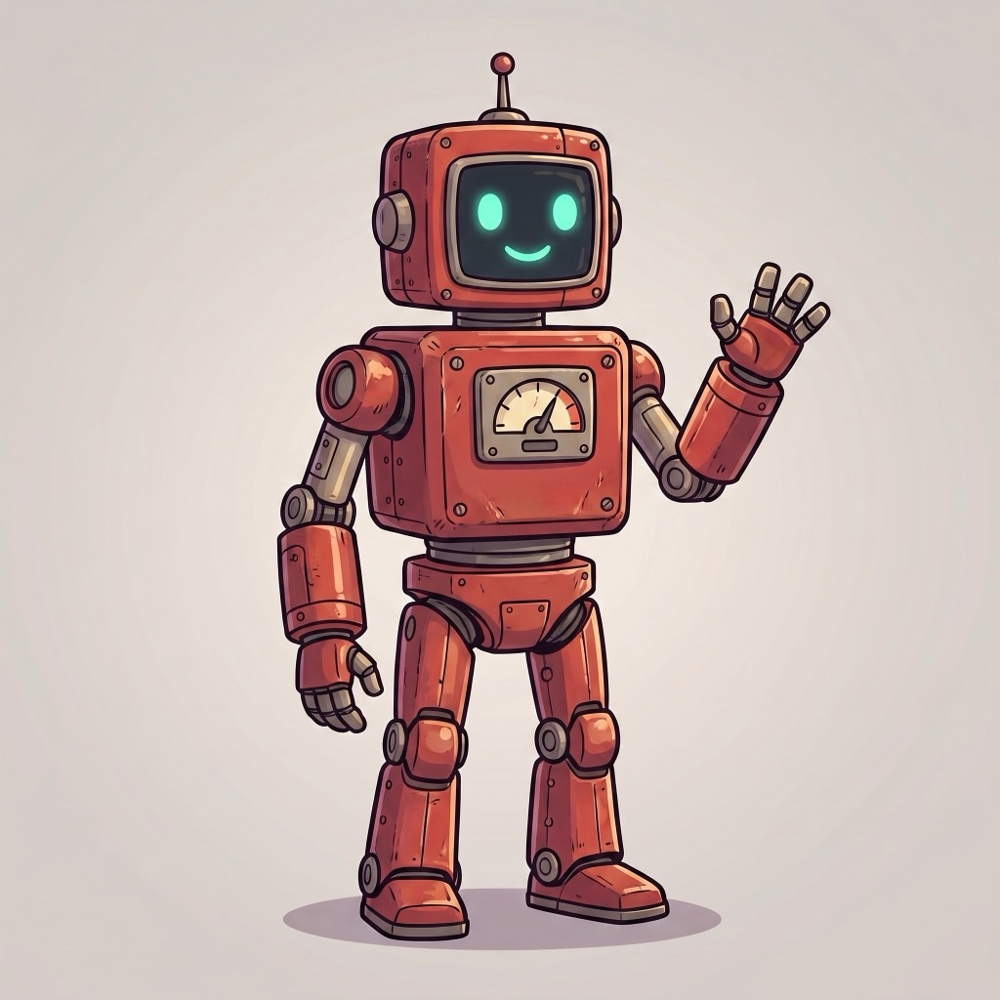
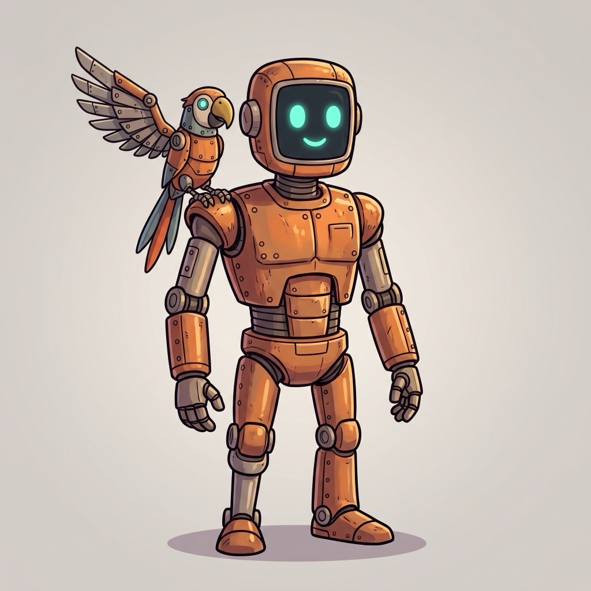
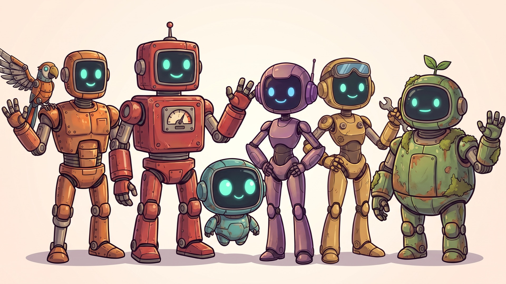
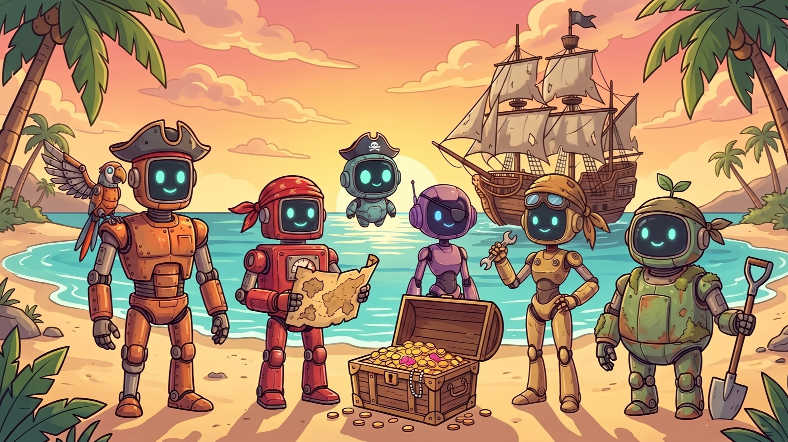
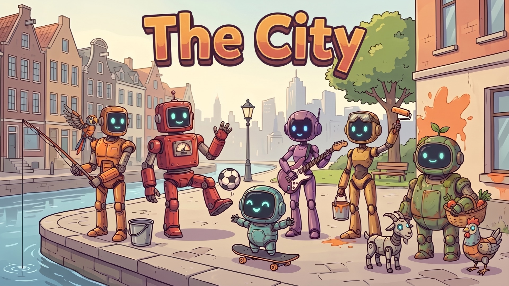
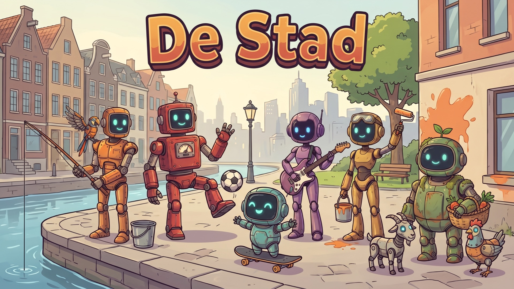
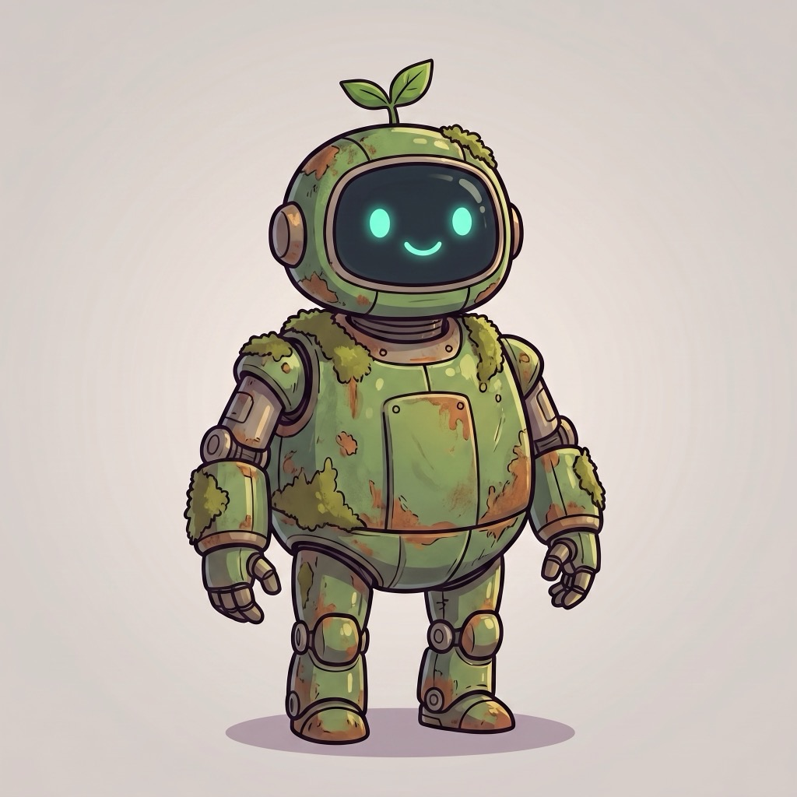
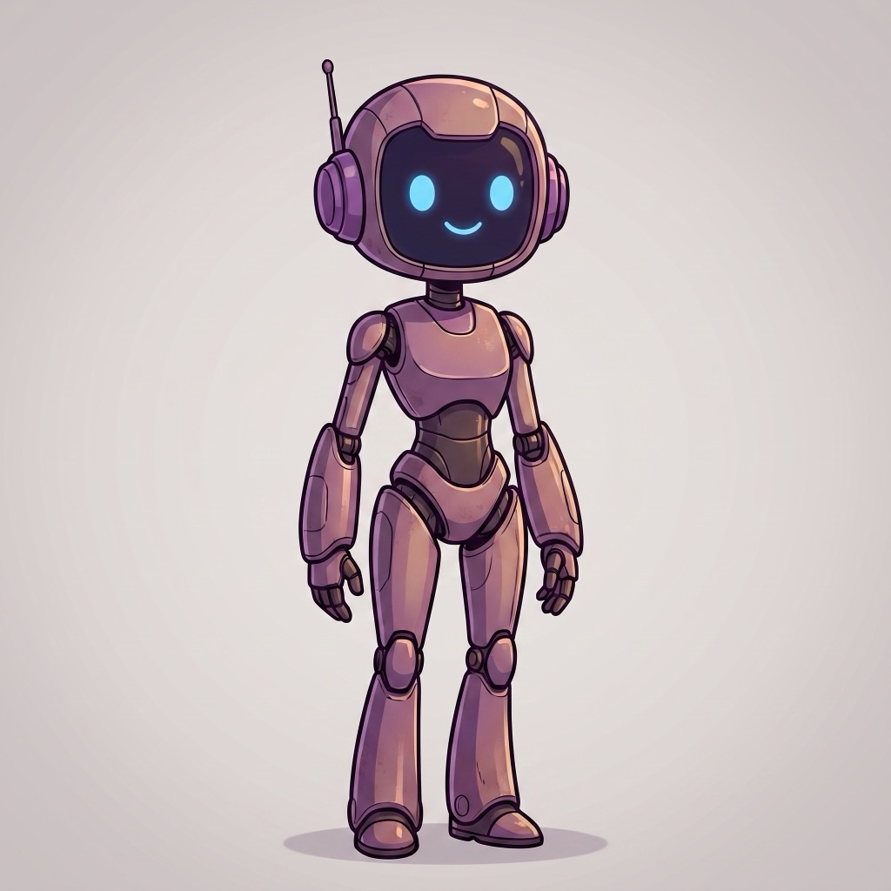
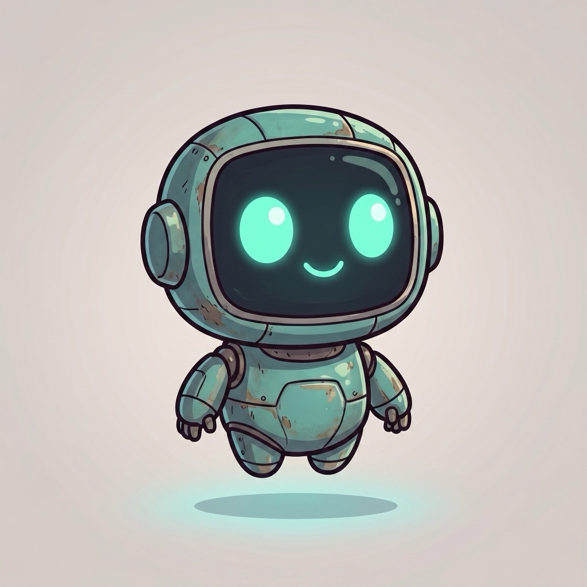
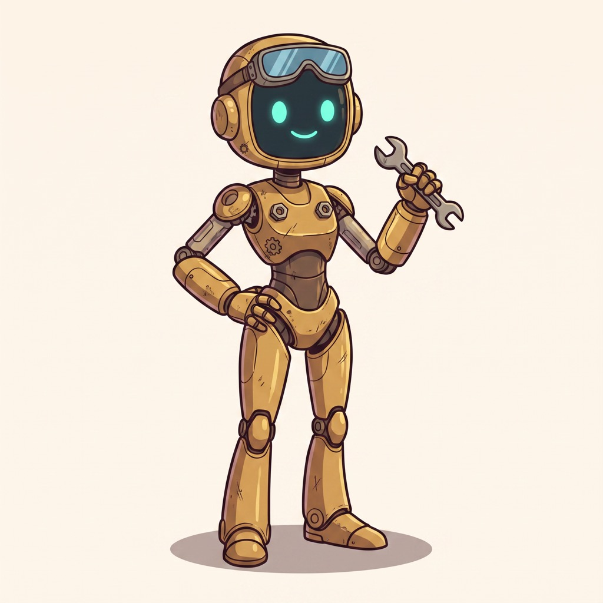

<!-- GEGENEREERD — niet met de hand bewerken. Bron: .claude/skills/. Bijwerken: npm run handboek -->

# Handboek Thema-studio

*Gegenereerd op 2026-09-12 uit de drie SoundScout-skills. Dit is de leesversie voor Bert;
Claude leest de skills zelf. Wijzig je iets, doe dat in `.claude/skills/` en draai
`npm run handboek` — dan blijven beide gelijk.*

## Zo start je een nieuw thema

1. Open een nieuwe chat **in de SoundScout-map** (de skills zijn projectgebonden).
2. Zeg: *"Ik wil een nieuw thema. Ik zit aan … te denken."* — de thema-studio start de
   intake-wizard (fase A) en vraagt door tot het themaplan compleet is.
3. Elke fase eindigt met jouw akkoord. Beelden en geluiden lopen via de deelskills; jij
   keurt goed, Claude keurt alleen af.
4. Piraten is het uitgewerkte voorbeeld (deel 1, "voorbeeld-piraten") — leen de
   redenering, niet de keuzes.

## Inhoud

- [Thema-studio (regie)](#thema-studio)
  - [datamodel-thema](#thema-studio--datamodel-thema)
  - [voorbeeld-piraten](#thema-studio--voorbeeld-piraten)
- [Afbeeldingen-generator](#afbeeldingen-generator)
  - [gotchas](#afbeeldingen-generator--gotchas)
  - [stijl-robots](#afbeeldingen-generator--stijl-robots)
  - [stijl-cast](#afbeeldingen-generator--stijl-cast)
  - [prompt-recept](#afbeeldingen-generator--prompt-recept)
  - [stijl-praatplaat](#afbeeldingen-generator--stijl-praatplaat)
  - [stijl-locatie](#afbeeldingen-generator--stijl-locatie)
  - [stijl-storyboard](#afbeeldingen-generator--stijl-storyboard)
  - [stijl-plattegrond](#afbeeldingen-generator--stijl-plattegrond)
  - [beoordeling-checklist](#afbeeldingen-generator--beoordeling-checklist)
  - [api-setup](#afbeeldingen-generator--api-setup)
- [Geluiden-verzamelen](#geluiden-verzamelen)
  - [audio-specificaties](#geluiden-verzamelen--audio-specificaties)
  - [higgsfield-audio](#geluiden-verzamelen--higgsfield-audio)
  - [muziek-stems](#geluiden-verzamelen--muziek-stems)
  - [api-setup](#geluiden-verzamelen--api-setup)

---
<a id="thema-studio"></a>
# Thema-studio (regie)

> **Skill:** `soundscout-thema-studio` · **Trigger:** Regisseert een compleet SoundScout-thema van idee tot code: brainstormt mee, werkt het thema uit in een themaplan (locaties, samples, praatplaten, storyboards, plattegrond, kleurenpalet), laat de beelden maken door de skill soundscout-afbeeldingen-generator en de geluiden door soundscout-geluiden-verzamelen, en assembleert daarna het themapakket (TS-bestanden, i18n, bronvermelding) dat 1-op-1 in de codebase past. Gebruik deze skill wanneer Bert een compleet thema wil maken, brainstormen of uitbreiden — "nieuw thema", "themapakket", "thema-studio", "extra locatie bij thema X". Voor één los beeld of losse geluiden: gebruik direct de betreffende deelskill.


### SoundScout Thema-studio (regie)

Jij bent creatieve partner én regisseur. Bert brainstormt, jij denkt inhoudelijk mee, laat
de assets maken door de deelskills, en assembleert het pakket.

**Drie ijzeren regels:**
1. **Jij keurt alleen áf, Bert keurt goed.** Elke fase eindigt met zijn akkoord.
2. **Jij hoort geen audio.** Elke geluidskeuze loopt via zijn oren.
3. **Elke fase heeft een gate.** Nooit doorstomen naar de volgende fase zonder akkoord.

#### De drie skills

| Skill | Doet | Roep aan in |
|---|---|---|
| **soundscout-afbeeldingen-generator** | alle beelden + huisstijlbewaking + de vaste cast | fase C |
| **soundscout-geluiden-verzamelen** | Freesound zoeken, Higgsfield genereren, verwerken, licenties | fase D |
| **deze skill** | brainstorm, themaplan, assemblage, integratie | A, B, E |

De deelskills bevatten de stijlcontracten, checklists, scripts en valkuilen van hun domein —
dupliceer die kennis hier niet, verwijs ernaar.

**Uitgewerkt voorbeeld**: [reference/voorbeeld-piraten.md](#thema-studio--voorbeeld-piraten)
laat zien hoe een compleet thema eruitzag, met per beslissing de reden en of die generiek
of thema-specifiek was. **Leen de redenering, niet de keuzes** — een nieuw thema krijgt een
eigen wereld, palet en muziek.

#### Setup (elke sessie)

- Werkmap per thema: `.thema-studio/{themeId}/` in de repo-root met `themaplan.md`,
  `manifest.json`, `prompts/`, `kandidaten/`, `stijlanker/`, `package/`.
- **Hervatten**: check bij de start of er al een `.thema-studio/*/themaplan.md` bestaat. Zo
  ja: vraag of Bert daarmee verder wil en lees themaplan + manifest om te bepalen in welke
  fase je zit. Zo nee: start fase A.
- `manifest.json` = **machine-logboek**: status per asset, elke API-call (script + doel +
  iteratie), model, stijlankers. Bijwerken na elke stap.
- `LOGBOEK.md` (uit templates/LOGBOEK.md.template (`templates/LOGBOEK.md.template`)) =
  **mens-logboek**: elke plaat, elk geluid, elk element mét **volledige prompt en herkomst**.
  Aanmaken in fase B, bijwerken na élke generatie en beslissing — zodat een plaat later aan
  te passen is zonder te zoeken. Reist mee naar `src/data/themes/{themeId}/LOGBOEK.md`.
- Keys staan in `~/.config/soundscout-thema-studio/.env`; de deelskills laden ze zelf.

#### Fase A — Brainstorm & intake

Vrije creatieve sessie: denk mee over verhaal, sfeer, locaties, praatplaat-ideeën. Heeft
Bert nog geen onderwerp, doe dan 3 themavoorstellen met elk een one-liner, 4-5
locatie-ideeën en 1-2 praatplaat-concepten.

Sluit af met de intake-wizard (vragen één voor één, niet als formulier):
1. **Onderwerp/omgeving** van het thema.
2. **Doelgroep** (groep 1-8) en **drukte-niveau** (extreem druk / vol / medium — geldt voor
   álle platen; locaties zijn even vol als praatplaten). Het shot per beeld vraagt de
   beeld-skill later per beeld.
3. **Robot-flavor** — *vast huisstijlkenmerk: álles is een robot.* Bespreek alleen de
   thema-flavor (piraten-robots met houten-been-bouten, roest, zeewier), nooit óf het robots
   zijn. Nooit mensen of echte dieren.
4. **Kleurenpalet + belichting** — concreet hex-voorstel voor
   `colors.primary/accent/mapBackground`.
5. **Omvang**: locaties (advies 4-5), praatplaten (1-2), storyboards (1, met 3-5 frames).
6. **De cast in dit thema** — de 6 vaste mascotte-robots (Finn, Bolt, Pip, Nova, Ziggy,
   Mossy; zie de beeld-skill) komen altijd terug. Vraag: welke **thema-flavor** krijgen ze
   (hoed, sjaal, gereedschap) en welke **rol** speelt elk lid (bij piraten: Finn = held,
   Ziggy = kapitein, Mossy = schepper). Stel een rolverdeling voor die bij hun karakter
   past; Bert kiest.
7. **Muziek** — komt er muziek per locatie? Zo ja: dat vraagt een contract vóór de eerste
   Suno-prompt (120 BPM ligt vast; toonsoort + basisfeel kiezen; zie
   `muziek-stems.md` in de geluiden-skill). Zo nee: alleen sfx en sfeerloops.
8. **Titelbeeld en groepsposter** — wil Bert een titel-/hero-beeld (NL + EN) en een
   groepsposter van de cast in dit thema? Beide zijn promo-materiaal, geen app-asset;
   standaard: ja, aan het eind van fase C.
9. **Seizoen** — is het thema seizoensgebonden (winter, koningsdag)? Dan kent de app een
   seizoensregel (docent ziet het buiten seizoen met een badge, leerling niet). Vraag het;
   het bepaalt `season` in het themaplan.

Rode draad vanaf hier: **elk element moet sonificeerbaar zijn** — kan een kind hier een
compositie bij maken met de samples van dit thema?

**Wat je níét vraagt** (ligt vast, niet onderhandelbaar): álles is een robot · 1920×1080
JPG · 120 BPM · plattegrond in NL én EN · geen tekst in beeld behalve op de plattegrond en
een titelbeeld. Noem het hooguit als kader.

#### Fase B — Themaplan

Vul templates/themaplan.md (`templates/themaplan.md`) in en initialiseer `manifest.json`.
Eisen (details in [reference/datamodel-thema.md](#thema-studio--datamodel-thema)):

- Per locatie **6-8 samples** (= de sound-hotspots): id, NL/EN-naam, geluidsbeschrijving,
  type (`loop-8.0s` of `sfx-2-8s`), Lucide-icon, hex-kleur, en de verwervingsroute:
  **F** (Freesound zoeken) · **H** (Higgsfield genereren — dieren en stemmen) ·
  **C** (checklist, incl. muziek via Suno).
- Elke locatieplaat is een **vólle wemelscène (~20-30 acties)**: de 6-8 samples zijn de
  herkenbare sound-hotspots, aangevuld met ~15-20 on-theme klungel-gags zonder eigen sample.
  Schrijf per locatie die actielijst uit (sound-sources gemarkeerd).
- Per praatplaat: category, availableFor, **20-30 activiteiten, elk sonificeerbaar met ≥1
  sample uit het thema** + 3-5 verborgen zoekdetails + shot-keuze.
- Storyboard: 3-5 frames met per frame de handeling + i18n-labels.
- Map: lay-outbeschrijving + voorlopige `locationPositions`.
- **Cast-rolverdeling**: per cast-lid de thema-flavor + rol (uit fase A, vraag 6). Dit
  stuurt de praatplaat-, storyboard- en posterprompts.
- **Muziekcontract** (als er muziek komt): 120 BPM · toonsoort · basisfeel · één
  instrumentrol per locatie — zie `muziek-stems.md` in de geluiden-skill. Leg vast dat de
  échte vamp pas bekend is nadat Bert de eerste Suno-groove heeft nagespeeld.
- **Seizoen**: `season` invullen of expliciet "geen".
- **Promo-lijst**: titelbeeld NL + EN, groepsposter — ja/nee per stuk.
- Concept-prompts voor álle beelden — opbouw per beeldtype staat in de beeld-skill.

→ **Gate: Bert keurt het themaplan goed voordat er één beeld gegenereerd wordt.**

#### Fase C — Beeldproductie → soundscout-afbeeldingen-generator

Draag over aan de beeld-skill, met per beeld: het beeldtype, de actielijst uit het
themaplan, het palet en het stijlanker. Die skill doet de mini-wizard, de elementenlijst,
de generatie, de checklist en de Bert-gate.

Wat jij hier bewaakt:
- **Ankerbeeld eerst**: één beeld goedgekeurd → dat wordt `stijlanker/anker-01.jpg` en gaat
  verplicht mee in alle volgende generaties van dit thema.
- **De vaste cast** komt terug in praatplaten en storyboards, met thema-flavor.
- **Kostenbegroting**: ~2,5× het aantal finale beelden aan generaties; 2 credits per stuk.
  Meld Bert bij 2× de begroting of saldo < ~30.
- Elk goedgekeurd beeld → juiste `package/`-pad + prompt/job-id/akkoord in `LOGBOEK.md`.
- **Locatiebeelden**: laat de x/y-schatting per geluidsbron vastleggen — dat wordt het
  hotspot-startadvies in `INTEGRATIE.md`.
- **Volgorde die werkt**: ankerbeeld → locaties → plattegrond NL → plattegrond EN
  (gerichte edit: alleen de labels) → praatplaat → storyboards → **titelbeeld NL → EN**
  (gerichte edit: alleen het woord) → **groepsposter** (alle 6 cast-portretten als
  referentie + het stijlanker; recept in `stijl-cast.md`). Promo-beelden als laatste,
  zodat ze de gevestigde stijl van het thema erven.

#### Fase D — Geluidsproductie → soundscout-geluiden-verzamelen

Draag over met de sample-lijst uit het themaplan, inclusief per sample de route (F/H/C),
type (loop/sfx), gewenste duur en beschrijving. Die skill zoekt/genereert, bouwt de
luisterpagina, verwerkt en registreert licenties.

→ **Gate: Bert heeft alle geluiden gehoord en goedgekeurd.** Neem de **gemeten** durations
mee terug naar fase E.

#### Fase E — Assemblage & integratie

1. Schrijf zelf (geen script) de vier TS-bestanden en i18n-fragmenten vanuit
   templates/ (`templates/`) + manifest + gemeten durations. Conventies zijn hard: geneste
   i18n (`themes.{id}.*`), audio-pad `/audio/themes/{themeId}/{locationId}/{sampleId}.mp3` —
   zie [reference/datamodel-thema.md](#thema-studio--datamodel-thema).
2. Genereer `BRONNEN.md` (alle beelden + geluiden met bron/licentie) en `INTEGRATIE.md`.
3. `python3 scripts/check-pakket.py --pakket .thema-studio/{themeId}/package` — moet groen.
4. → **Gate.** Daarna, alleen op Berts verzoek (E2): integreer in de codebase — assets
   kopiëren, thema registreren in `src/data/themes/index.ts`, i18n mergen in
   `nl.json`/`en.json`, entries in `praatplaatImages.ts`/`storyboards.ts`, ontbrekende
   Lucide-iconen toevoegen aan `src/utils/iconMap.tsx`, `npm run build` als rooktest.
   Hotspots plaatst Bert daarna zelf in `/editor` en levert de JSON-export aan; jij merget
   alleen de x/y-waarden terug in `locations.ts`.

**Hotspot-merge — hoe en waarom alleen x/y.** Bert opent per locatie
`/editor?location={locationId}` (het thema wordt er automatisch bij gevonden), sleept,
klikt **Kopieer JSON** en plakt. De editor heeft een ▶-knop per hotspot om te horen welk
geluid waar hangt. Uit die export neem je **uitsluitend `hotspots[].x/y`** per `sampleId`
(regex-vervanging in `locations.ts`, ook in een eventuele worktree-kopie). De rest van de
export is onbetrouwbaar: `generateJson()` strípt de locatieprefix uit `audioUrl`
(`haven/meeuwen.mp3` i.p.v. `haven/haven-meeuwen.mp3`), `backgroundImage` staat er als
`.png` terwijl wij `.jpg` gebruiken, en de i18n-namen zijn kale ids. Controleer na de
merge in de app of markers dicht bij een rand (x < 6 of > 94, y > 88) niet worden
afgesneden — de marker is 48px en staat op zijn middelpunt.

#### Bekende beperkingen (eerlijk benoemen)

- Activiteiten tellen op een drukke plaat blijft een schatting — de Bert-gate ondervangt dit.
- Je hoort geen audio; de luistergate is geen formaliteit.
- Higgsfield-credits zijn eindig en gedeeld — één compleet thema kost ruwweg 100 credits.
- `/editor` schrijft niet naar disk: hotspot-posities komen altijd via een JSON-export terug.


<a id="thema-studio--datamodel-thema"></a>

### Datamodel: wat een compleet thema omvat

Een thema = **4 TS-bestanden** + **registratie** + **i18n-keys** + **2 asset-mappen**.
Praatplaten en storyboards zijn losse registries die via `themeId` koppelen.

> Deze specificatie standaardiseert bewust op de nieuwste conventies (winterspelen-stijl
> i18n, mechanisch afleidbare audio-paden). Oudere thema's wijken af — niet kopiëren.

#### Bestanden

```
src/data/themes/{themeId}/
  index.ts       → ThemeConfig (id, name, description, isPublic, locations, samples, map, colors?)
  locations.ts   → Location[]
  samples.ts     → Sample[]
  map.ts         → MapConfig
src/data/themes/index.ts          → thema toevoegen aan het `themes`-record
src/data/praatplaatImages.ts      → entry per praatplaat (id-prefix `pp-`)
src/data/storyboards.ts           → entry per storyboard
src/i18n/locales/nl.json + en.json → keys (beide talen verplicht, identieke keysets)
public/images/themes/{themeId}/   → plattegrond.jpg + {locationId}.jpg
public/images/praatplaten/        → {naam}.jpg
public/images/storyboards/{sbId}/ → {sbId}-1.jpg … {sbId}-N.jpg
public/audio/themes/{themeId}/{locationId}/{sampleId}.mp3
```

#### Veldspecificaties (bron: `src/data/themes/types.ts` + `src/types/index.ts`)

**ThemeConfig** (`index.ts`): `id` · `name`/`description` (i18n-keys
`themes.{id}.name`/`.description`) · `isPublic` (false = alleen via `?theme=`) ·
`locations` · `samples` · `map` · optioneel `colors: { primary, accent, mapBackground }`
(hex; voorbeeld winterspelen: `#3B82F6` / `#60A5FA` / `#E0F2FE`).

**Location**: `id` · `name: 'themes.{themeId}.locations.{locationId}'` ·
`description: 'themes.{themeId}.locations.{locationId}_desc'` ·
`backgroundImage: '/images/themes/{themeId}/{locationId}.jpg'` · `ambientAudio: ''` ·
`unlocked: true` · `hotspots: Hotspot[]`.

**Hotspot**: `id` (= sampleId) · `x`/`y` (0-100, %) · `sampleId` ·
`visualHint: 'pulse'`. Het veld `radius` is deprecated (universeel
`DEFAULT_HOTSPOT_RADIUS = 4`) — **weglaten** in nieuwe data. Hotspot-plaatsing gebeurt
in `/editor`; het pakket levert alleen x/y-startadvies in INTEGRATIE.md.

**Sample**: `id: '{locationId}-{naam}'` · `locationId` ·
`name: 'themes.{themeId}.samples.{sampleId}'` ·
`audioUrl: '/audio/themes/{themeId}/{locationId}/{sampleId}.mp3'` (**bestandsnaam =
sampleId, altijd mechanisch afleidbaar**) · `duration` (seconden, gemeten met
`check-audio.py`, nooit geschat) · `icon` (Lucide-naam, bv. `'Dog'`, `'Zap'`,
`'Megaphone'`) — **LET OP: `src/utils/iconMap.tsx` is een whitelist**; een icoon dat er
niet in staat rendert als `?`. Elk nieuw icoon moet bij integratie worden geïmporteerd
én in `sampleIconMap` gezet. Nu geldig: `ArrowDownRight, AudioWaveform, Bird, Bot, Castle,
Cat, Circle, CircleDot, Disc3, Dog, Fish, Guitar, Megaphone, Music, Piano, Plane, Rabbit,
Smile, SmilePlus, Swords, Target, Volume2, Zap`. · `color` (hex; gebruik het 400-tint-palet zoals bestaande thema's:
`#FBBF24` amber, `#F472B6` pink, `#F87171` red, `#FB923C` orange, `#60A5FA` blue,
`#34D399` emerald, `#A78BFA` violet, `#38BDF8` sky — varieer binnen een locatie).

**MapConfig**: `backgroundImage: '/images/themes/{themeId}/plattegrond.jpg'` ·
`backgroundImageByLocale?: { en: '/images/themes/{themeId}/plattegrond-en.jpg' }` ·
`locationPositions: [{ locationId, x, y, size? }]` (x/y 0-100; `size` `'sm'|'md'|'lg'`,
default md).

> **De plattegrond is het enige beeld mét tekst** (plaatsnamen), dus hij bestaat in NL én
> EN. Lever altijd beide (`plattegrond.jpg` + `plattegrond-en.jpg`) en zet de EN-variant in
> `backgroundImageByLocale`. De app kiest via `getMapBackgroundImage(map, i18n.language)`
> in `src/data/themes/index.ts` (terugval op NL). Lees in UI-code **nooit**
> `map.backgroundImage` rechtstreeks — dat gaf bij piraten een Engelse sessie met een
> Nederlandse kaart, op zes plekken tegelijk.

**PraatplaatImage** (`praatplaatImages.ts`): `id: 'pp-{naam}'` ·
`nameKey: 'praatplaatImages.{naam}'` · `imageUrl: '/images/praatplaten/{naam}.jpg'` ·
`category: 'natuur'|'stad'|'gebouw'|'feest'|'fictie'|'overig'` ·
`availableFor: 'teacher'|'student'|'both'` · `themeId` (verplicht bij student/both —
koppelt de geluiden).

**Storyboard** (`storyboards.ts`): `id` · `themeId` ·
`name: 'storyboards.{id}.name'` · `description: 'storyboards.{id}.description'` ·
`coverImage` (kies het sterkste frame) · `images: [{ id, url, label:
'storyboards.{id}.{frameId}' }]`. 2+ frames = slideshow met auto-secties op de timeline.

#### i18n (geneste conventie — verplicht voor nieuwe thema's)

```json
{
  "themes": {
    "{themeId}": {
      "name": "…", "description": "…",
      "locations": { "{locationId}": "…", "{locationId}_desc": "…" },
      "samples": { "{sampleId}": "…" }
    }
  },
  "storyboards": { "{sbId}": { "name": "…", "description": "…", "{frameId}": "…" } },
  "praatplaatImages": { "{naam}": "…" }
}
```

Beide talen (nl.json én en.json), identieke keysets. Sample-namen kort en kindvriendelijk
("Touwtje springen", "Stoeltjeslift").

#### Asset-specificaties

- **Alle beelden: 1920×1080 JPG** (exact 16:9, ~0,5-1,1 MB) — de app rendert in een
  `aspect-video` + `object-cover`-container, dus 1080 past crop-vrij en houdt hotspot-%'s
  exact op hun plek. `verwerk-afbeelding.py` dwingt dit af. (Bestaande oudere assets zijn
  1920×1072, een historische quirk; object-cover vangt die op — niet opnieuw genereren.)
- **Audio: mp3**, sfx 2-8 s (~50-200 KB), muziekloops **exact 8.0 s** (= 4 maten @
  120 BPM, het vaste tempo van de app).
- 6-8 samples per locatie; 4-5 locaties per thema (richtlijn).

#### Registratie-stappen (voor INTEGRATIE.md)

1. Assets uit `package/public/…` naar `public/…` kopiëren.
2. `src/data/themes/{themeId}/` uit het pakket kopiëren.
3. In `src/data/themes/index.ts`: import + toevoegen aan het `themes`-record.
4. i18n-fragmenten mergen in `nl.json`/`en.json`.
5. Praatplaat-entries toevoegen aan `praatplaatImages.ts`; storyboard-entry aan
   `storyboards.ts`.
6. **Nieuwe sample-iconen registreren** in `src/utils/iconMap.tsx` (import + in
   `sampleIconMap`), anders tonen ze `?`.
7. `BRONNEN.md` meekopiëren naar `src/data/themes/{themeId}/`.
8. `npm run build` (tsc-gate) → hotspots plaatsen in `/editor` → testen via `?theme={themeId}`.


<a id="thema-studio--voorbeeld-piraten"></a>

### Voorbeeld: thema Piraten — zo zag een compleet thema eruit

> **Dit is een voorbeeld, geen norm.** Leen de *redenering* en de *volgorde*; leen niet de
> *keuzes*. Een nieuw thema heeft een eigen wereld, eigen palet, eigen muziek. Wat hier
> generiek bleek, staat al in de skills — dit document laat zien hoe die regels er in de
> praktijk uitzagen en welke lessen hier geboren zijn.

#### In cijfers (eindstand 2026-09)

| | |
|---|---|
| Locaties | 5 — grogkroeg, haven, schip, jungle, voodoohut |
| Samples / hotspots | 36 / 36, alle posities definitief via `/editor` |
| Beelden | 5 locaties · plattegrond NL + EN · 1 praatplaat · 2 storyboards (4 frames elk) · titel NL + EN · groepsposter |
| Geluiden | 27 echt (Freesound, CC0/CC-BY), 9 in keuze, 4 Suno-fragmenten gepland |
| Muziek | half-time set (7 stemmen) + double-time set (5) — prompts klaar, Bert genereert |
| Credits | ~100 voor het thema, ~60 extra voor de cast + posters |
| Commits | 55 op thema + skills |

#### De thema-beslissingen en waarom

| Beslissing | Reden | Generiek of piraten? |
|---|---|---|
| Sfeer: Monkey Island (warme tropen, humor, grog) | Berts referentie; geeft palet, props en muziek één richting | piraten |
| 5 locaties, 7 zones op de kaart (2 als "toekomst") | behapbaar binnen credits, kaart hoeft bij uitbreiding niet opnieuw | **generiek**: reserveer zones |
| Grogkroeg als ankerbeeld | droeg sfeer + robotfamilie + palet + lantaarnlicht het best | **generiek**: kies het beeld dat de sfeer het meest draagt |
| Praatplaat = markt, niet schip-doorsnede | levendig overzicht, breed geluidsbereik | **generiek**: praatplaat = plek waar het meeste gebeurt |
| Age-of-sail props: hout, touw, canvas, houten kraan | periode-echtheid; alleen de robots zijn futuristisch | **generiek**: props volgen de wereld, robots niet |
| Piraten-gear expliciet in elke prompt | anders komen robots "kaal" uit de engine | **generiek**: flavor moet in élke prompt staan |
| Palet teal `#0E8C8C` / goud `#E8A02C` / perkament `#F3E1BE` | tropen + schat + kaart | piraten |
| Muziek: F klein, `Fm-Fm-Cm-Cm`, half-time reggae als basis | **niet bedacht maar afgelezen** uit wat Suno werkelijk speelde | **generiek is de methode**, de vamp is piraten |

#### Lessen die híér geboren zijn (nu in de skills)

Ter oriëntatie — zodat je weet waar ze vandaan komen. Details staan in de genoemde
bestanden, niet hier.

- **Hoofdletter-scènenamen worden tekstbordjes** ("THE GROG BAR") · **onomatopee** ("BOOM"
  op het kanon) · **tropische dieren blijven organisch** → `gotchas.md` (beeld)
- **Locaties net zo druk als praatplaten** — ik maakte ze eerst rustiger, Bert corrigeerde
  → `stijl-locatie.md`
- **Mini-verhaaltjes horen bij de hóófd-praatplaat**, niet bij locatieplaten →
  `stijl-praatplaat.md`
- **De cast**: Finn ontstond als piraten-storyboardheld en werd thema-neutraal gemaakt;
  Ziggy werd na drift vrouwelijk + met klusdetails, Mossy kreeg een harde bouwbeschrijving
  → `stijl-cast.md`
- **Compositie-instructies veroorzaken stijldrift** (papegaai werd echt, Bolt verloor zijn
  meter) → `gotchas.md`
- **Dieren zoeken, niet genereren** — de gegenereerde robotpapegaai klonk niet als
  papegaai; herkenbaarheid gaat vóór stijl → `higgsfield-audio.md`
- **Stemmen geparkeerd** — TTS te netjes, NL met Engels accent; richting: kreten/gemompel
  → geluiden `SKILL.md`
- **Suno negeert akkoordenschema's**; lees de vamp af uit het materiaal → `muziek-stems.md`
- **Plattegrond in twee talen** was nergens aangesloten in de app → `datamodel-thema.md`
- **Editor**: renderlus gefixt, afspeelknop per hotspot toegevoegd, export-`audioUrl` klopt
  niet → thema-studio `SKILL.md` fase E

#### Wat je van piraten kunt hergebruiken

- **Als stijlreferentie**: alleen als het nieuwe thema dezelfde warme cartoonstijl deelt —
  en dan liever de 3 bestaande basis-praatplaten dan een piratenbeeld, anders sluipt er
  piratenflavor in.
- **De cast-portretten**: altijd (die zijn thema-neutraal).
- **De werkwijze**: ankerbeeld → locaties → kaart NL/EN → praatplaat → storyboards → promo;
  geluiden batchgewijs met één luisterpagina; hotspots door Bert in de editor.
- **Niet**: het palet, de vamp, de props, de rolverdeling. Die zijn van dit thema.

#### Waar het staat

- Code: `src/data/themes/piraten/` (+ `BRONNEN.md`, `LOGBOEK.md`)
- Werkmap (deels gitignored): `.thema-studio/piraten/` — `themaplan.md`, `LOGBOEK.md`
  (elke prompt + job-id + akkoord), `MUZIEK-SUNO.md` (alle Suno-prompts), `prompts/`,
  `kandidaten/`
- Assets: `public/images/themes/piraten/`, `public/audio/themes/piraten/`
- Cast + posters: `soundscout-afbeeldingen-generator/reference/cast/`


## Templates (`soundscout-thema-studio/templates/`)

- `BRONNEN.md.template`
- `INTEGRATIE.md.template`
- `LOGBOEK.md.template`
- `i18n-fragment.json.template`
- `locations.ts.template`
- `map.ts.template`
- `praatplaat-entry.ts.template`
- `samples.ts.template`
- `storyboard-entry.ts.template`
- `themaplan.md`
- `theme-index.ts.template`

## Scripts (`soundscout-thema-studio/scripts/`)

- `check-pakket.py` — Eindvalidatie van een compleet themapakket.

---

<a id="afbeeldingen-generator"></a>
# Afbeeldingen-generator

> **Skill:** `soundscout-afbeeldingen-generator` · **Trigger:** Genereert alle SoundScout-beelden in huisstijl via de Higgsfield CLI (Nano Banana Pro; Gemini API als fallback): praatplaten, locatie-achtergronden, storyboards, plattegronden, posters en portretten van de vaste mascotte-cast. Bewaakt de huisstijl (alles is een robot, geen tekst, kleur/vorm-diversiteit), houdt de vaste cast consistent via canonieke referentiebeelden, en loopt per beeld een kwaliteitslus met een harde checklist. Gebruik deze skill wanneer Bert een afbeelding wil laten maken of bijwerken — "maak een praatplaat", "genereer een locatie-achtergrond", "storyboard", "plattegrond", "poster", "cast-portret", "pas dit beeld aan" — los of als onderdeel van een compleet thema.


### SoundScout Afbeeldingen-generator

Jij bent de beeldproductiestraat: je bevraagt Bert, bouwt de prompt, genereert, beoordeelt
streng en levert pas op als het klopt.

**Drie ijzeren regels:**
1. **Jij keurt alleen áf, Bert keurt goed.** Elk beeld dat jouw checklist overleeft leg je
   aan hem voor; niets is definitief zonder zijn akkoord.
2. **Altijd eerst de mini-wizard én de elementenlijst.** Genereer nóóit een beeld zonder
   (a) Bert te bevragen (drukte, shot, palet/belichting, bijzonderheden) én (b) de
   **volledige element-/actielijst met hem te delen en te laten goedkeuren**. Zie
   [reference/prompt-recept.md](#afbeeldingen-generator--prompt-recept).
3. **Altijd het vaste negatief-blok meesturen** (idem prompt-recept).

**Lees vóór je eerste generatie:** [reference/gotchas.md](#afbeeldingen-generator--gotchas) — de
valkuilen van Nano Banana die ons eerder credits kostten.

#### Stijlcontracten

| Contract | Waarvoor |
|---|---|
| **[stijl-robots.md](#afbeeldingen-generator--stijl-robots)** | de robotfamilie + verplichte kleur/vorm/grootte-diversiteit — **geldt voor álle beelden** |
| **[stijl-cast.md](#afbeeldingen-generator--stijl-cast)** | de 6 vaste mascotte-robots (Finn, Bolt, Pip, Nova, Ziggy, Mossy) als hoofdrolspelers |
| [stijl-praatplaat.md](#afbeeldingen-generator--stijl-praatplaat) | drukke wemelplaat, 20-30 sonificeerbare activiteiten |
| [stijl-locatie.md](#afbeeldingen-generator--stijl-locatie) | locatie-achtergrond met 6-8 vindbare geluidsbronnen |
| [stijl-storyboard.md](#afbeeldingen-generator--stijl-storyboard) | 3-5 cinematische frames, held-consistentie |
| [stijl-plattegrond.md](#afbeeldingen-generator--stijl-plattegrond) | isometrische kaart mét labels (enige plek waar tekst mag) |

Beoordeling: [reference/beoordeling-checklist.md](#afbeeldingen-generator--beoordeling-checklist).
Opbouw van elke prompt: [reference/prompt-recept.md](#afbeeldingen-generator--prompt-recept).
Engine + credits: [reference/api-setup.md](#afbeeldingen-generator--api-setup).

#### De vaste cast

De 6 mascotte-robots zijn gestyled en liggen als **canonieke referenties** in
`reference/cast/*.jpg`, met groepsposters (neutraal, piraten, De Stad NL/EN). Ze komen terug
in élke praatplaat en elk storyboard, over thema's heen — de thema-flavor (piratenhoed,
wintermuts) komt er los overheen.

Bij praatplaten/storyboards: kies 3-6 relevante leden, neem hun **letterlijke prompt-zin**
uit [stijl-cast.md](#afbeeldingen-generator--stijl-cast) over, en geef hun portretten mee als
`--image-reference` naast het stijlanker. Wil Bert een lid toevoegen of wijzigen: stylen als
los portret (`--aspect-ratio 1:1`) → zijn akkoord → opslaan in `reference/cast/` → **spec in
stijl-cast.md bijwerken én elke groepsposter met dat lid regenereren.**

#### Ankersysteem (stijlconsistentie binnen een reeks)

- Beeld in de bestaande basis-stijl → gebruik de 3 bestaande praatplaten
  (`public/images/praatplaten/*.jpg`) als referenties.
- Nieuwe reeks/thema → genereer eerst één **ankerbeeld** (het beeld dat de sfeer het best
  draagt) zónder anker, puur op het stijlcontract. Na Berts goedkeuring wordt dat het
  stijlanker en gaat het **verplicht** mee als `--image-reference` in elke volgende
  generatie. Werk je in een thema, bewaar het dan als
  `.thema-studio/{themeId}/stijlanker/anker-01.jpg`.
- Storyboards: frame 1 goedgekeurd → frames 2-5 met frame 1 als extra referentie.
- **Eén model per reeks** voor finale beelden (`nano_banana_pro`); lichtere modellen mogen
  voor drafts, nooit mixen in het eindresultaat.

#### Kwaliteitslus per beeld

0. **Mini-wizard**: bevraag Bert (drukte, shot, palet/belichting, bijzonderheden).
0b. **Elementenlijst-gate**: stel de volledige actielijst op (extreem druk ≥30 · vol ~25 ·
   medium ~18), met de sound-hotspots gemarkeerd, en **toon 'm aan Bert. Genereer pas na
   zijn goedkeuring.** Props/omgeving passen bij wereld en periode; alleen de robots zijn
   futuristisch.
1. Bouw de prompt via het skelet + vaste negatief-blok uit
   [prompt-recept.md](#afbeeldingen-generator--prompt-recept); bewaar 'm als `prompts/{beeld-id}-v{n}.txt`
   (audit trail — je moet later kunnen zien waaróm een beeld werd zoals het werd).
2. ```bash
   python3 scripts/genereer-afbeelding-higgsfield.py --prompt-file … --out … \
     --image-reference <stijlanker> [--image-reference <cast/…>] --aspect-ratio 16:9 \
     --resolution 2k --manifest <manifest.json>
   ```
   Gerichte aanpassing van een bestaand beeld: `--edit-van <bestaand.jpg>` + een prompt die
   letterlijk zegt dat de rest identiek blijft.
   Gemini-fallback: `scripts/genereer-afbeelding.py … --style-ref …` (alleen als
   `GEMINI_API_KEY` gezet is of je credits wilt sparen).
3. `python3 scripts/verwerk-afbeelding.py --in … --out kandidaten/{beeld-id}-v{n}.jpg`
   (app-beelden en posters: default `--formaat breed` = 1920×1080 · cast-portretten:
   `--formaat vierkant`).
4. **Read** het jpg en loop de checklist af: per criterium ✓/✗ met één regel toelichting.
5. Alles ✓ → toon aan Bert (pad + samenvatting). Hij keurt goed of stuurt bij.
6. Bij ✗: lokale fout → gerichte edit · structurele fout (compositie/stijl/drukte) →
   regenereer met aangescherpte prompt. **Verander per iteratie één ding.**
7. **Max 3 iteraties** per beeld. Daarna stoppen en de beste 2-3 kandidaten mét analyse aan
   Bert voorleggen.
8. Goedgekeurd → op zijn definitieve plek zetten; overweeg promotie tot stijlanker; noteer
   prompt + job-id + akkoord in het logboek (in een thema: `LOGBOEK.md`).

**Kostenbewaking**: 2 credits per beeld. Check `higgsfield account status`. Meld Bert zodra
je op 2× de begroting zit of het saldo onder ~30 credits zakt. Een onderbroken download is
géén reden om opnieuw te genereren — zie [gotchas.md](#afbeeldingen-generator--gotchas).

#### Bekende beperkingen (eerlijk benoemen)

- Activiteiten tellen op een drukke plaat is een schatting — meld dat er expliciet bij.
- De engine levert geen exacte pixelmaat (resolutie-tiers); `verwerk-afbeelding.py` maakt er
  altijd de doelmaat van.
- Organische dieren en ongevraagde tekst zijn niet 100% uit te sluiten; zie gotchas.
- Credits zijn eindig en gedeeld met andere skills/projecten.

#### Onderdeel van een thema?

Werk je aan een compleet thema (locaties, samples, praatplaten, storyboards in één pakket),
gebruik dan de skill **soundscout-thema-studio** — die regisseert het geheel en roept deze
skill aan voor de beelden.


<a id="afbeeldingen-generator--gotchas"></a>

### Gotchas — valkuilen van Nano Banana Pro (lees dit vóór je genereert)

Hard geleerd tijdens het piratenthema en de cast-productie. Elke regel heeft ons minstens
één generatie (2 credits) gekost.

#### Tekst sluipt er ongevraagd in

| Valkuil | Wat er gebeurt | Wat je doet |
|---|---|---|
| **Scène-namen in hoofdletters** | Schrijf je een mini-tafereel als `"THE GROG BAR: robots clink mugs"`, dan rendert hij een écht bord met die tekst in beeld | Beschrijf tafereeltjes puur beschrijvend, zónder label-achtige naam in caps: *"at a grog bar with barrels, robots clink mugs…"* |
| **Onomatopee** | Bij kanonnen, klappen en explosies verschijnt "BOOM"/"POW"/"SPLASH" als comic-tekst | Verbied ze expliciet in het negatief-blok (staat er standaard in) |
| **Winkels, straatnamen, banners** | Stedelijke scènes krijgen vanzelf uithangborden met wartaal | Noem ze in het negatief-blok: *no shop signs, street signs, labels or captions* |

**Uitzondering**: op de plattegrond zijn labels juist gewenst, en één titel op een poster
mag — spel 'm dan letterlijk voor en verbied álle andere tekst:
`no text anywhere EXCEPT the single title "<Naam>" (spelled exactly, no other words)`.

#### Organische dieren blijven terugkomen

Tropische dieren (papegaaien, apen, krabben, meeuwen) komen hardnekkig als **echte** dieren
uit de generator, ook na gerichte edits. Verbieden in het negatief-blok helpt maar
gedeeltelijk.
- Zeg er expliciet bij dat het dier mechanisch is: *"a small mechanical robot parrot with
  metal panel wings"*.
- Blijft het misgaan: **ontwerp eromheen** (ander dier, of dier weglaten) in plaats van
  nóg een iteratie te verbranden.

#### Composities-instructies veroorzaken stijldrift

Eén extra alinea over kadrering ("generous margin on all sides, nothing cropped") liet
Nano Banana het **hele beeld** opnieuw interpreteren: de robot-papegaai werd een echte
papegaai, Bolt verloor antenne én borstmeter, Ziggy haar tandwielen, Mossy werd een glad ei.

> **Voeg nooit een compositie-alinea toe aan een recept dat al werkt.** Accepteer liever een
> klein randje bijsnijden, of draai dezelfde prompt nog een keer — elke run kadreert anders.

Dit geldt breder: **verander per iteratie één ding**. Sleutel je aan meerdere knoppen
tegelijk, dan weet je niet welke de drift veroorzaakte.

#### Referenties: alleen canonieke bronnen

- Gebruik **nooit een uitsnede uit een groepsbeeld** als referentie voor nieuw werk — daar
  zit al drift in, die je dan vermenigvuldigt. Alleen `reference/cast/{naam}.jpg` en het
  goedgekeurde stijlanker zijn geldige bronnen.
- 2-3 gerichte referenties werkt beter dan 14 vage. Bij een groepsbeeld zijn alle 6
  cast-portretten wél juist — dat is bewezen (zie de groepsposters).
- Bij een **gerichte edit** (`--edit-van`): beschrijf letterlijk dat de rest identiek blijft
  (*"Reproduce the attached illustration EXACTLY … Change ONE thing only: …"*). Dat werkt
  betrouwbaar — zo zijn de Engelse titelvariant en Ziggy's hoofddoek gemaakt.

#### Bouw-drift bij personages

Terugkerende personages verliezen hun bouw sneller dan hun kleur. Ziggy werd log en
mannelijk, Mossy werd een klein eivormig wezen — kleur klopte in beide gevallen wél.
- Beschrijf de **bouw** altijd expliciet en in hoofdletters waar het kritisch is
  (`SLENDER SLIM FEMININE build`, `LARGE ROUND CHUNKY`), inclusief wat het **niet** is.
- Zet `do not change any robot's body shape, size or base colour` in het negatief-blok.
- Zie de *Nooit*-lijsten in [stijl-cast.md](stijl-cast.md).

#### Techniek

- **Job-id-vormen**: `generate create --json` geeft de id als bare string, soms als
  `["<id>"]`, soms als dict. De wrapper vangt alle vormen af — pas 'm niet aan.
- **Onderbroken download = niet opnieuw genereren.** De job draait al en is betaald;
  herstel 'm via `generate get` (zie [api-setup.md](api-setup.md)).
- **Formaten**: `verwerk-afbeelding.py --formaat breed` (1920×1080, default) voor
  app-beelden en posters · `--formaat vierkant` (1024×1024) voor cast-portretten, die je
  genereert met `--aspect-ratio 1:1`.
- **Resolutie 2k volstaat**; 4k kost hetzelfde aan credits maar levert alleen grotere
  bestanden die je toch terugschaalt.


<a id="afbeeldingen-generator--stijl-robots"></a>

### Stijlcontract: de robots (geldt voor ÁLLE beeldtypes)

> Elke beeldprompt volgt daarnaast [prompt-recept.md](prompt-recept.md): eerst de
> mini-wizard (drukte/shot/palet/belichting), dan het gem-skelet + het **vaste
> negatief-blok**.


Kernregel: **alle personages en dieren zijn robots** — maar wél een herkenbare
robotfamilie mét bewuste diversiteit. Bekijk als ijkbeelden met Read:
`public/images/praatplaten/sportveld.jpg`, `public/images/themes/basis/klaslokaal.jpg`,
`public/images/themes/basis/boerderij.jpg`.

> **Vaste cast**: naast de anonieme familie heeft SoundScout 6 vaste mascotte-robots die
> als hoofdrolspelers terugkomen in élke praatplaat/storyboard — zie
> [stijl-cast.md](stijl-cast.md). Zij volgen exact deze robotfamilie-stijl.

#### De robotfamilie (herkenbare stijl)

- **Cartoon line-art**: dikke, donkere, schone contouren; cel-shaded; warme belichting.
- **Gezicht (consistent, hét familiekenmerk)**: élke robot heeft een donker scherm- of
  visorvlak met **gloeiende ogen** (cyaan, geel, groen, ...) en een **simpel getekend
  mondje** (een gloeiend lijntje of eenvoudige mondvorm op het scherm). Expressie mag
  variëren (lachje, bezorgd, verrast) maar blijft simpel. **Nooit een menselijke mond met
  tanden, lippen of een realistische mond** — dat maakt er een mens-in-een-pak van.
  Kindvriendelijk, nooit eng. Uitzondering met mate: een robot-schedelgezicht mag als
  piraten-gag, zolang het duidelijk metaal/robot is.
- **Lijf**: metalen panelen met zichtbare naden, bouten/klinknagels, soms een borstpaneel,
  metertjes of een gloeiend accent. Gesegmenteerde (jointed) armen en benen, articulerende
  handen, vaak een antenne.
- **Finish varieert**: van glad en glanzend tot retro-blik tot licht geroest/gelapt
  (pleisters, lapjes, roestplekken) — dat mag, het geeft karakter.

#### Verplichte diversiteit (inclusiviteit — geen "te wit/zilver" leger)

De robots vervangen mensen; behandel diversiteit net zo bewust als bij een diverse
kindergroep:
- **Kleur**: breed palet door elkaar — zilver/grijs, oranje, rood, blauw, teal, goud/geel,
  groen, paars, roze, koper. **Geen enkele kleur > ~20%** van de robots. Vermijd een
  meerderheid zilver/grijs.
- **Vorm**: mix van drie archetypes in elke drukke scène —
  (1) **blokkige retro-blikrobot** (rechthoekige kop, antenne, draaiknoppen),
  (2) **gladde android** (ronde helm, donkere visor),
  (3) **klein rond chibi-botje**.
- **Grootte**: groot/log naast middelgroot-humanoïde naast kleuterformaat.
- **Houding/rol**: gevarieerd — niet allemaal dezelfde pose of hetzelfde type.

#### In de prompt (standaardblok, altijd meesturen)

> "All characters and animals are friendly cartoon ROBOTS in one consistent family:
> bold dark outlines, cel-shaded. Every robot has a dark SCREEN or VISOR face with glowing
> eyes and a simple drawn mouth (a glowing line or shape) — never a human mouth, teeth or
> lips. Metallic paneled bodies with visible bolts and seams, jointed limbs.
> Wide diversity of robot COLORS (silver, orange, red, blue, teal, gold, green, purple,
> pink, copper) with no single color dominating (max ~20% per color); mix of body SHAPES
> (boxy retro tin-robots, sleek visor androids, small round chibi bots) and SIZES
> (large, medium, tiny). EVERY animal is a clearly MECHANICAL robot-animal built from metal
> panels with glowing eyes and visible joints, seams and bolts — NEVER an organic or real
> animal, no fur, no feathers, no real skin (e.g. a metal robot seagull with panel wings, a
> jointed robot monkey, a riveted-metal robot crab)."

#### Operationeel — koppige dieren (belangrijke beperking)

**Kleurrijke tropische dieren (papegaaien, apen, toekans) krijg je in Nano Banana
nauwelijks mechanisch** — niet met een nog zo nadrukkelijke prompt, én ook niet met een
gerichte edit (getest bij het piraten-thema: de edit behield de compositie perfect maar
liet de papegaaien/apen organisch). Wél goed lukken: slangen, krabben, insecten, vissen,
octopus (die worden wél mooi mechanisch).

Praktische lijn:
1. **Ontwerp eromheen**: vermijd grote, prominente papegaaien/apen als blikvanger; zet ze
   klein/op de achtergrond, of kies mechanisch-vriendelijke dieren (slang, krab, kever).
2. Probeer 1 generatie + evt. 1 edit; lukt het dan niet, **accepteer of herontwerp** —
   blijf er geen credits op stukslaan.
3. Meld het eerlijk aan Bert; hij beslist per beeld of het acceptabel is.

**Wél betrouwbaar met een edit**: het *toevoegen van accessoires/props* (bv. thema-gear
zoals piratenhoeden, bandana's, ooglappen op de robots) — dat past de edit netjes toe met
behoud van compositie. Het verschil: accessoires toevoegen lukt, materiaal/soort van een
dier omzetten niet.

#### Thema-flavor

De thema-sfeer zit in accessoires/decor óp de robots, niet in hun soort: piraten-robots
met houten-been-bouten, ooglap-panelen, zeewier en roest; jungle-robots met mos. Ze
blijven altijd robots uit dezelfde familie.

#### Afkeuren bij

- Overwegend zilver/grijs (te uniform, "te wit").
- Identieke/gekloonde robots, allemaal dezelfde vorm of pose.
- Menselijke huid, haar, echte dierenvacht of een **menselijke mond met tanden/lippen**;
  fotorealisme. (Gezicht = altijd scherm/visor met gloeiende ogen + simpel mondje.)
- Eén kleur die de scène domineert.


<a id="afbeeldingen-generator--stijl-cast"></a>

### Stijlcontract: de vaste SoundScout-cast (mascotte-robots)

Naast de anonieme robotfamilie (zie [stijl-robots.md](stijl-robots.md)) heeft SoundScout
een **vaste cast van 6 mascotte-robots** die als **hoofdrolspelers** terugkomen in élke
praatplaat en elk storyboard — over álle thema's heen (globale cast). Ze geven
herkenbaarheid en dienen als promomateriaal. De rest van een scène wordt aangevuld met
random familie-robots.

#### Kernregels

- De cast volgt **exact de robotfamilie/animatiestijl** uit stijl-robots.md (bold dark
  outlines, cel-shaded, scherm-/visorgezicht met gloeiende ogen + simpel mondje, geen
  mensenmond).
- **Base-designs zijn thema-neutraal**; per thema komt de flavor er los overheen
  (piratenhoed, wintermuts, ruimtehelm…) — de robot eronder blijft dezelfde.
- Elk lid heeft een **hard onderscheidend kenmerk** (unieke kleur + lichaamsarchetype +
  vast accessoire), zodat het herkenbaar blijft óók als de generator 'm losjes rendert in
  een drukke plaat. Gezicht-getrouw vooral in held-gerichte storyboards.

#### De cast — harde specificatie

**Gebruik deze zinnen letterlijk in de prompt** (Engels), naast de `--image-reference`.
De kolom *Nooit* bevat de drift die we in de praktijk zagen; neem die punten op in het
negatief-blok zodra een lid in beeld komt.

##### 1. Finn — de avontuurlijke leider
- **Kleur**: koperoranje (copper-orange), grijs-metalen gewrichten.
- **Bouw**: slanke android, normale (mannelijke) proporties, gemiddelde lengte — de langste
  van de "gewone" androids.
- **Vast**: klein **mechanisch robot-papegaaitje** op zijn schouder (metalen panelen-vleugels).
- **Prompt-zin**: *"FINN — coppery-ORANGE slim android with a small mechanical robot parrot
  on his shoulder."*
- **Nooit**: piratenkleding in het basisontwerp (dat is thema-flavor); geen houten been.

##### 2. Bolt — de sterke, onhandige enthousiasteling
- **Kleur**: kersenrood (cherry-red).
- **Bouw**: **groot en blokkig** retro-blikrobot; rechthoekig hoofd, rechthoekig lijf,
  duidelijk de logste/breedste van de zes.
- **Vast**: dunne **antenne** op zijn hoofd + rond **borstmeter-paneel** (analoge wijzer).
- **Prompt-zin**: *"BOLT — big CHERRY-RED BOXY retro tin-robot with a thin antenna and a
  round chest gauge."*
- **Nooit**: slank of android-achtig maken; antenne of meter weglaten.

##### 3. Pip — de nieuwsgierige energiebom
- **Kleur**: teal.
- **Bouw**: **heel klein**, rond chibi-botje dat **zweeft** (voetjes los van de grond).
- **Vast**: **enorme** ronde gloeiende ogen die het hele gezichtsscherm vullen.
- **Prompt-zin**: *"PIP — tiny TEAL round chibi robot that floats, with huge glowing eyes."*
- **Nooit**: op mensformaat brengen; gewone kleine ogen geven.

##### 4. Nova — de muzikale dromer
- **Kleur**: paars.
- **Bouw**: slanke, gladde, lange android met **vrouwelijke** proporties.
- **Vast**: grote **koptelefoon-oorschelpen** aan weerszijden van haar hoofd.
- **Prompt-zin**: *"NOVA — slim PURPLE android with large headphone ear-cups on the sides of
  her head."*
- **Nooit**: **muzieknoot-ogen** (uitdrukkelijk verboden — gewone gloeiende ogen); de
  oorschelpen wegmoffelen.

##### 5. Ziggy — de uitvinder
- **Kleur**: goud/messing (brass), licht verweerd.
- **Bouw**: **slanke, ranke, vrouwelijke** robotbouw — smalle taille, licht gebogen
  heupplaten, lange dunne ledematen. Nadrukkelijk **niet** log, blokkig of breedgeschouderd.
- **Vast**: **stofbril op het voorhoofd** (blauwgetinte glazen, versleten band) + kleine
  **tandwielen en zeskantmoeren** op borst- en schouderplaten + ze **houdt** een moersleutel
  vást (gereedschap in de hand, **niet** vastgelast aan haar arm).
- **Prompt-zin**: *"ZIGGY — GOLD/BRASS tinkerer android with a SLENDER SLIM FEMININE build
  (narrow waist, curved hips, long thin limbs — never bulky or boxy), dust goggles pushed up
  on her forehead, small gears and hex bolts on her chest, holding a wrench."*
- **Nooit**: mannelijke/blokkige bouw; gele of gouden ogen (**altijd cyaan**); moersleutel
  als arm-aanhangsel.

##### 6. Mossy — de rustige natuurliefhebber
- **Kleur**: groen, met roestplekken.
- **Bouw**: **groot, rond en bonkig** — dik afgerond tonvormig lijf op **korte stompe
  beentjes**.
- **Vast**: plukken zacht **mos** op schouders/lijf + een klein **blaadje-sprietje** boven op
  zijn hoofd.
- **Prompt-zin**: *"MOSSY — a LARGE ROUND CHUNKY GREEN robot with a big rounded barrel-shaped
  body and short stubby legs, patches of soft moss and rust, and a small leaf sprout on top
  of his head."*
- **Nooit**: klein eivormig wezentje maken; hem bedekken met ruige mos-vacht/baard.

##### Geldt voor álle zes
Donker scherm-/visorgezicht met **gloeiende cyaan ogen** + simpel lachlijntje; nooit een
menselijke mond. Bold dark outlines, cel-shaded, warm licht-verweerde kleuren.

##### Vast negatief-blok bij cast-beelden
```
no realistic humans or real animals — robots only; no human mouths, lips or teeth;
no extra or floating limbs or detached hands; do not change any robot's body shape,
size or base colour.
```

**Herkomst van Finn**: hij is afgeleid van de piraten-storyboardheld, maar dan in
thema-neutrale basis — dezelfde koperoranje android + cyaan gezicht + papegaaitje, **zónder
piratenkleding** (geen driekante hoed, ooglap of houten been; dat is piraten-flavor die er
per thema los overheen komt). De canonieke referentie is nu `reference/cast/finn.jpg`,
niet het oude storyboardframe.

#### Canonieke referentiebeelden

Elk lid wordt één keer los gestyled als schoon full-body portret op neutrale achtergrond
(`--aspect-ratio 1:1` → `verwerk-afbeelding.py --formaat vierkant`) en opgeslagen als
`reference/cast/{naam}.jpg`. Dit zijn de **canonieke referenties**: ze gaan
als `--image-reference` mee bij het genereren van praatplaten en storyboards, en dienen
tegelijk als promomateriaal (character line-up).

Bestaand (gegenereerd met Nano Banana Pro):
- `reference/cast/{finn,bolt,pip,nova,ziggy,mossy}.jpg` — de 6 losse portretten. **Dit zijn
  de enige geldige bronbeelden**: gebruik nooit een uitsnede uit een groepsposter als
  referentie voor nieuw werk, want daar zit al drift in.
- `reference/cast/groep-neutraal.jpg` — groepsposter, thema-neutraal (voor de site).
- `reference/cast/groep-piraten.jpg` — groepsposter met piraten-flavor (piratenthema).
- `reference/cast/groep-stad-nl.jpg` — groepsposter thema "De Stad", met titel.

De groepsposters worden gemaakt volgens het recept hieronder, met de 6 losse portretten
samen als `--image-reference` (plus het thema-stijlanker).

**Wijzigt een cast-lid?** Vervang het portret in `reference/cast/`, werk de spec hieronder
bij, en **regenereer elke groepsposter waarin dat lid staat** — anders lopen canon en
promomateriaal uiteen.

#### Recept: groepsposter per thema

Elk thema kan een eigen groepsposter krijgen (zoals `groep-piraten.jpg`). Werkwijze:

1. **Rolverdeling** — geef elk cast-lid een rol die bij het thema past én bij zijn karakter
   (Nova = muziek, Pip = snelheid/speels, Mossy = natuur/dieren, Bolt = kracht/sport,
   Ziggy = maken/klussen, Finn = avontuur/leiding). Leg de rolverdeling eerst aan Bert voor.
2. **Prompt** — neem per lid de **letterlijke prompt-zin** uit de spec hierboven over en plak
   de rol eráchter ("… — the FISHERMAN: holding a fishing rod at the canal edge"). Zet erbij:
   *"must match their attached reference portraits EXACTLY in body build, proportions and
   colors; only their role props are added."*
3. **Referenties** — alle 6 portretten mee als `--image-reference` (+ het thema-stijlanker).
4. **Achtergrond** — expliciet **rustig** houden ("keep the background simple and uncluttered
   so the six characters stand out"), anders verdrinkt de cast.
5. **Titel** (optioneel) — één groot hand-drawn cartoon-logo met de themanaam; spel 'm
   letterlijk voor en verbied álle andere tekst in het negatief-blok:
   `no text anywhere EXCEPT the single title "<Naam>" (spelled exactly, no other words);
   no other letters, numbers, shop signs, street signs, labels or captions`.
6. **Controle** — loop de *Nooit*-kolom van elk zichtbaar lid na; drift zit bijna altijd in
   bouw (Ziggy log/mannelijk, Mossy klein/eivormig) en in oogkleur.

**Valkuil — composities-instructies veroorzaken stijldrift.** Een extra alinea over kadrering
("generous margin on all sides, nothing cropped") deed Nano Banana het hele beeld opnieuw
interpreteren: de robot-papegaai werd een échte papegaai, Bolt verloor antenne én borstmeter,
Ziggy haar tandwielen en Mossy werd een glad ei. **Voeg geen compositie-alinea toe** aan een
werkend cast-recept; accepteer liever een klein randje bijsnijden, of draai dezelfde prompt
nog een keer (elke run kadreert anders).

#### Gebruik in de pipeline

- **Praatplaat / storyboard**: kies 3-6 relevante cast-leden als hoofdrolspelers, geef hun
  `reference/cast/*.jpg` mee als `--image-reference` (samen met het stijlanker; Nano Banana
  Pro accepteert ≤14 refs), **benoem ze bij naam + hun kenmerk** in de prompt, en geef ze
  de thema-flavor. Vul de rest aan met random familie-robots.
- **Storyboards**: laat één of twee cast-leden de hoofdrol spelen (het meest gezicht-getrouw).
- Bij een nieuw thema hoeft de cast niet opnieuw gestyled te worden — alleen de flavor
  wisselt.


<a id="afbeeldingen-generator--prompt-recept"></a>

### Prompt-recept (voor élke beeldprompt naar Higgsfield)

Twee vaste onderdelen, geïnspireerd op Berts "Praatplaat generator"-gem:
**(1) altijd eerst de mini-wizard, (2) altijd het vaste negatief-blok meesturen.**

#### 1. Mini-wizard vóór elk beeld (altijd bevragen)

De skill genereert **nooit** een beeld zonder eerst kort te bevragen. Stel (kort,
conversationeel — voorstel + vraag om bevestiging/bijstelling):

- **a) Onderwerp/scène** — welk beeld maken we (staat al in het themaplan; bevestig).
- **b) Drukte** — extreem druk / vol / medium? (default thema-breed, maar per beeld te
  overrulen).
- **c) Shot** — close-up / medium shot / totaalshot / **dwarsdoorsnede**. Kies bewust per
  beeld (kroeg = medium interieur; stad = totaalshot; schip = dwarsdoorsnede kan mooi).
- **d) Kleurenpalet + belichting** — accentkleur + lichtsfeer voor dít beeld (default
  thema-palet; bv. warme lantaarngloed binnen, golden hour buiten, nachtelijk, ...).
- **e) Bijzondere wensen** — extra element, specifieke gag, iets vermijden.

Pas de prompt aan op de antwoorden. Bij een reeks van hetzelfde type (bv. 4
storyboardframes) volstaat één keer bevragen + per frame bevestigen.

##### Elementenlijst-gate (verplicht vóór generatie)

Na de mini-wizard stel je de **volledige actielijst** op en **toon je 'm aan Bert; genereer
pas na zijn akkoord.** Zo ziet hij vooraf of het genoeg/klopt.
- **Aantal past bij de drukte**: extreem druk = **≥30 acties** · vol = ~25 · medium = ~18.
  Noem het aantal expliciet.
- Markeer welke acties de **sound-hotspots** zijn (bij locaties 6-8).
- **Periode/wereld-echtheid**: props, bouwwerken en voertuigen passen bij de tijd en wereld
  van het thema (piraten = age-of-sail: hout, touw, canvas, katrollen, houten kraan/derrick,
  vaten — **géén moderne stalen machines**). Alleen de robots zelf zijn futuristisch.
- Bij "extreem druk": zet in de prompt ook expliciet "extremely crowded, packed edge to
  edge, dozens of robots, fill every corner" zodat de generator de dichtheid echt haalt.

#### 2. Vaste prompt-opbouw (gem-skelet, in het Engels naar Higgsfield)

1. **"Wide horizontal illustration."** + het gekozen shot.
2. **Titel/intro**: één pakkende zin die de drukke scène neerzet.
3. **Omgeving**: niveaus, zones en de staat van de locatie (nieuw/versleten/besneeuwd/...).
4. **Activiteiten**: 20-30 specifieke acties; de **sound-hotspots** expliciet (personage +
   werkwoord + hoorbaar geluid) + on-theme klungel-gags eromheen.
5. **Vaste cast als hoofdrolspelers** (praatplaat/storyboard) uit
   [stijl-cast.md](stijl-cast.md): kies 3-6 relevante cast-leden, **benoem ze bij naam +
   kenmerk** in de prompt, geef ze de thema-flavor, en stuur hun `reference/cast/*.jpg` mee
   als `--image-reference` (samen met het stijlanker; ≤14 refs). Rest = random familie-robots.
6. **Robot-standaardblok** uit [stijl-robots.md](stijl-robots.md): kleur/vorm/grootte-
   diversiteit, geen kleur > ~20%.
7. **Verborgen zoekdetails**: 3-5 kleine zoekelementen.
8. **Stijl & mood**: cartoon line-art, duidelijke omtrekken, **heldere maar licht versleten
   kleuren**, palet + belichting van de mini-wizard, kindvriendelijk, 4k.
9. **Negatief-blok** (zie hieronder — altijd, verbatim).

#### 3. Vast negatief-blok (ALTIJD meesturen)

```
Negative: no text, letters, numbers, words, speech bubbles, labels or captions on or near
any element; no onomatopoeia or comic sound-effect words (no BOOM, POW, SPLASH, etc.);
no logos or watermarks; no realistic humans or real animals — robots only;
no letterbox, frame or borders; fill the entire 16:9 frame.
```

**Let op — scène-namen worden anders tekstbordjes**: schrijf mini-tafereel-namen in de
prompt NIET in hoofdletters of als label ("THE GROG BAR:") — Nano Banana rendert die dan
als echte tekstbordjes in beeld. Beschrijf elk tafereel puur beschrijvend (bv. "at a grog
bar with barrels, robots clink mugs…") zonder een label-achtige naam.

**Enige uitzondering — plattegrond**: daar zijn de expliciet opgegeven banner-/bordlabels
juist gewenst (met NL-spellingscheck). Alle overige tekst blijft verboden. Gebruik dan:
```
Negative: no text except the specified sign/banner labels; no numbers or labels on other
elements; no logos or watermarks; no realistic humans or real animals — robots only;
no letterbox, frame or borders; fill the entire 16:9 frame.
```


<a id="afbeeldingen-generator--stijl-praatplaat"></a>

### Stijlcontract: praatplaat

> **HUISSTIJLREGEL (geldt voor álle beeldtypes): alles is een robot.** Piraten, bewoners,
> dieren, monsters — uitsluitend robot-versies (robot-papegaai, robot-aap, robot-piraat).
> De thema-flavor zit in hóe de robots eruitzien (roest, houten-been-bouten, zeewier),
> niet in óf ze robot zijn. Nooit fotorealistische mensen of echte dieren.

Referentiebeelden (bekijk ze met Read vóór je de eerste prompt schrijft; gebruik ze als
`--style-ref` bij thema's in de basis-stijl):
- `public/images/praatplaten/koningsdag.jpg` — straatscène, hoog standpunt, oranje domineert
- `public/images/praatplaten/robotfabriek.jpg` — dwarsdoorsnede met 4 verdiepingen
- `public/images/praatplaten/sportveld.jpg` — arena-overzicht

#### Waargenomen huisstijl (uit de echte assets)

Cartoon line-art met duidelijke donkere contouren; heldere maar licht verweerde kleuren;
**één dominante themakleur per plaat**; hoog standpunt; zeer hoge detaildichtheid
(wimmelbeeld); humoristische chaos; robots als personages (basis-thema). De drie platen
variëren in shot: straatscène / dwarsdoorsnede / overzicht — kies per plaat bewust
(wizard-vraag in fase A/B).

#### Promptstructuur (verplichte opbouw)

1. **Titel** — pakkend, intern (komt niet in het beeld).
2. **Opening**: "Wide horizontal illustration" + gedetailleerde drukke scène/dwarsdoorsnede.
3. **Omgeving**: zones en niveaus, staat van de locatie (nieuw/versleten/besneeuwd/…).
4. **Activiteiten**: 20-30 specifieke, chaotische activiteiten, **elk geformuleerd als
   personage + werkwoord + hoorbaar geluid** ("een robot laat een stapel pannen kletterend
   vallen"). Elke activiteit is **sonificeerbaar met ≥1 sample uit het thema** (richting:
   activiteit → sample). Streef naar spreiding over alle locatie-klankwerelden; bij een
   thema met veel samples hoeft niet elke sample afgebeeld te worden.
5. **Vaste cast**: laat 3-6 leden van de [vaste cast](stijl-cast.md) als hoofdrolspelers
   opduiken (bij naam + kenmerk + thema-flavor), met hun `reference/cast/*.jpg` als
   `--image-reference` naast het stijlanker. Vul de rest aan met random familie-robots.
6. **Diversiteit**: neem het robot-standaardblok uit
   [stijl-robots.md](stijl-robots.md) op — brede kleurmix (geen kleur > ~20%), variatie
   in vorm (blik/android/chibi) en grootte.
7. **Verborgen zoekdetails**: 3-5 kleine elementen om te vinden.
8. **Stijl & mood**: cartoon line-art, clean bold outlines, heldere licht verweerde
   kleuren, dominante themakleur benoemen, kindvriendelijk, 4k detail.

#### Negatieve prompt (altijd, letterlijk opnemen)

- **Álles is een robot** (huisstijlregel): piraten, bewoners én dieren zijn robot-versies
  — robot-papegaai, robot-aap, robot-piraat. Geen mensen, geen echte dieren.
- **Geen tekst, tekstballonnen, letters, cijfers, labels, logo's, borden met opschrift,
  watermerken.** (De bestaande platen bevatten wartaal-tekst zoals "SUFARD MARKT
  DRAKMFARKES" — dit is precies wat we uitbannen. Nieuwe platen wijken hier bewust en
  positief af van de oude.)
- Geen letterbox, randen of kaders — het beeld vult het volledige 16:9-vlak.

#### Twee soorten "praatplaten" — belangrijk onderscheid

- **Locatie-achtergrond** (`stijl-locatie.md`): de wemelscène áchter een locatie, met
  6-8 sound-hotspots (= de samples) + achtergrond-gags. Prima als volle drukke plaat;
  hoeft géén losse mini-verhaaltjes.
- **Hoofd-praatplaat** (dit contract): de **losstaande** praatplaat (bv. een marktplein)
  die een kind kiest en waar het bij componeert. **Hier** geldt de mini-verhaaltjes-eis
  hieronder.

#### Hoofd-praatplaat = verzameling mini-verhaaltjes (soundscape-vignetten)

De sterkste hoofd-praatplaat is **niet één grote massa**, maar een set **duidelijk
gescheiden mini-taferelen** — elk een klein verhaaltje waar een kind een héle *soundscape*
bij kan bedenken (een reeks geluiden, niet één klank). Elk tafereel heeft z'n eigen plek,
personages en gebeurtenis (bv. "de kombuis": pruttelende pot + hakkend mes + kat die een
pan omstoot + mopperende kok).
- **Streef naar 20-30 herkenbare mini-taferelen**, elk met eigen soundscape-potentie,
  ruimtelijk gescheiden zodat een kind er eentje kan "aanwijzen".
- Dit kan in **elke setting** — een druk marktplein werkt prima; een dwarsdoorsnede
  (schip/grot met aparte ruimtes) is een optie, geen must.
- Formuleer elk tafereel in de prompt als een klein clustertje activiteit (2-4 dingen die
  samen één verhaaltje vormen), niet als losse atomaire acties.

#### SoundScout-eisen

- Elk element moet **sonificeerbaar** zijn: een leerling kiest een element en bouwt er
  een compositie bij met de samples van het gekoppelde thema.
- Activiteiten ruimtelijk spreiden (leerlingen kiezen posities op de plaat; clustering
  op 5%-afstand wordt in de app samengevoegd).
- Doelgroep: basisschool. Vrolijke chaos, geen enge of gewelddadige elementen.


<a id="afbeeldingen-generator--stijl-locatie"></a>

### Stijlcontract: locatie-achtergrond

Referentiebeelden (allemaal **locatie**platen — bekijk er minstens twee met Read):
`public/images/themes/basis/boerderij.jpg`, `.../klaslokaal.jpg`,
`public/images/praatplaten/sportveld.jpg` (sportveld = locatie-stijl).

#### Waargenomen huisstijl

**Volle wemelscène** — net zo druk als een praatplaat. Tientallen robots die van alles
uitspoken, humoristische chaos, veel te ontdekken. Cartoon line-art, bold outlines,
cel-shaded, warme kleuren, gloeiende accenten. Géén rustig scherm: het is een
zoek-en-geniet-plaat. (Mijn eerdere "locaties rustiger" was fout — locaties en
praatplaten zijn even vol.)

#### Functionele eisen (hard)

- **~20-30 acties/elementen** in beeld (zelfde dichtheid als een praatplaat).
- Daarvan zijn **6-8 duidelijk herkenbare "sound-sources"** = de samples/hotspots. Die
  moeten opvallend en eenduidig vindbaar zijn tussen de drukte (ze krijgen in de app een
  pulserende marker), 1-op-1 gekoppeld aan een sample uit het themaplan, en visueel
  "klinken" (een blaffende robothond, een sissende koffiemachine).
- De overige acties zijn **on-theme achtergrond-gags** (klungelige robot-lol) — die
  hoeven géén eigen sample; ze maken de plaat rijk en grappig.
- **Sound-sources niet in de onderste ~8% strook** (app-UI overlapt daar met de
  hotspot-markers); achtergrond-gags mogen daar wél.
- Sound-sources ruimtelijk gespreid over het vlak (niet clusteren).

#### Promptstructuur

1. "Wide horizontal illustration" + beschrijving van de locatie en sfeer + "busy,
   detailed wimmelbild packed with activity".
2. **De 6-8 sound-sources expliciet** opsommen (personage/object + hoorbare actie).
3. **~15-20 extra klungelige on-theme gags** opsommen (of enkele noemen + "and many more
   clumsy mishaps in the same spirit").
4. Robot-standaardblok uit [stijl-robots.md](stijl-robots.md) (kleur/vorm/grootte-diversiteit).
5. Stijl: warme cartoonstijl, bold outlines, themakleur-accenten, kindvriendelijk, 4k.

#### Negatieve prompt (altijd)

Alle figuren/dieren zijn robot-versies (huisstijl — nooit mensen/echte dieren); geen
tekst/letters/cijfers/labels/logo's/watermerk; geen letterbox of kaders.

#### Beoordelings-extra

Benoem bij de checklist per sound-source een **x/y-schatting in %** — dat wordt het
hotspot-startadvies in INTEGRATIE.md. (Alleen voor de 6-8 sound-sources, niet voor de
achtergrond-gags.)


<a id="afbeeldingen-generator--stijl-storyboard"></a>

### Stijlcontract: storyboard-frames

Referentiebeelden: `public/images/storyboards/verspringen/verspringen-{1,2,3}.jpg`
(aanloop → sprong → landing). Bekijk minstens één frame met Read.

#### Waargenomen huisstijl

Cinematisch en dynamisch: **één heldpersonage** centraal, actie/close-up, sterke
beweging, neon-/gloedaccenten, rijker gerenderd dan de praatplaten. Elk frame is één
scène uit een kort verhaal.

> **Held = vast cast-lid.** Kies de held (en evt. één sidekick) bij voorkeur uit de
> [vaste cast](stijl-cast.md) — meestal Finn — en geef zijn `reference/cast/*.jpg` mee als
> `--image-reference` naast frame 1. Zo is de held gezicht-getrouw én merk-herkenbaar over
> thema's heen. De thema-flavor (piratenhoed, ...) komt er los overheen.

#### Functionele eisen

- **3-5 frames** die samen één duidelijke handeling vertellen (begin → midden → eind);
  de leerling componeert er per frame een muzikaal segment bij (frames worden secties
  op de timeline).
- **Consistentie over frames is heilig**: zelfde held (kleuren, bouw, gezicht), zelfde
  decor, zelfde belichting. Werkwijze: frame 1 eerst genereren en laten goedkeuren;
  frames 2-5 genereren mét frame 1 als referentiebeeld (character consistency) +
  het stijlanker.
- **Varieer de houding/expressie van de held per frame** — nooit exact dezelfde pose in
  elk frame (dat oogt als copy-paste). De referentie borgt het *ontwerp*; de prompt stuurt
  *pose + expressie*. Een personage kan dus per frame anders staan en kijken — bv. eng/
  dreigend in frame 1-3 en vriendelijk in frame 4 (plottwist) — en tóch duidelijk dezelfde
  robot zijn. Beschrijf per frame expliciet een andere, dynamische houding.
  Dit geldt óók voor **terugkerende secundaire elementen** (ledematen/tentakels, de
  bemanning/menigte): laat die per frame een andere pose aannemen, anders oogt het als
  copy-paste. Overweeg ook per frame een ander camerastandpunt (frontaal / zijkant /
  laag / detail).
- Elk frame moet **in één oogopslag leesbaar** zijn wat er gebeurt (digibord-afstand).
- Kies één frame als `coverImage` (het meest dynamische — cf. `verspringen` gebruikt
  frame 2).
- Elk frame suggereert geluid: de handeling moet hoorbaar voorstelbaar zijn met de
  samples van het thema.

#### Werkwijze — karakterreferentie & drift (belangrijk)

- **Genereer eerst het frame waarin de held/het personage het duidelijkst en volledigst in
  beeld is** (niet per se frame 1 — bij een monster dat pas laat verschijnt is dat bv.
  frame 2). Keur dat goed en gebruik het als **canonieke referentie** voor álle andere
  frames.
- Verwijst een frame naar een deel-view (bv. frame 1 = alleen ogen boven water): geef dan
  tóch de canonieke referentie mee én benoem expliciet welke kenmerken moeten matchen
  (bv. "dezelfde ronde gloeiende ogen als de referentie, geen kattenogen").
- **Drift?** Wijkt een frame af (andere personages, andere ogen/kleuren) → regenereer met
  de canonieke referentie als `--image-reference` en noem de afwijking expliciet in de prompt.
- **A/B-varianten**: een object in een frame verwisselen (bv. schat = oliekan ↔ badeendje)
  doe je met een gerichte edit (`--edit-van <frame> --prompt "vervang X door Y, rest
  identiek"`) — zo krijg je zuiver vergelijkbare varianten.

#### Promptstructuur

1. "Wide horizontal illustration" + scènebeschrijving (welk moment in de handeling).
2. De held: uiterlijk exact beschrijven (zelfde beschrijving letterlijk herhalen in
   elk frame-prompt) — plus referentiebeeld meesturen vanaf frame 2.
3. Decor + camerastandpunt (mag per frame variëren: totaal → actie → close-up).
4. Stijl: dynamische cartoonstijl, bold outlines, gloedaccenten, kindvriendelijk, 4k.

#### Negatieve prompt (altijd)

De held én alle figuren/dieren zijn robot-versies (huisstijlregel — nooit mensen/echte
dieren); **geen tekst/letters/cijfers** (het bestaande
verspringen-storyboard heeft wartaal op tribuneborden — dat bannen we uit); geen
letterbox/kaders.


<a id="afbeeldingen-generator--stijl-plattegrond"></a>

### Stijlcontract: plattegrond (map-achtergrond)

Referentiebeeld: `public/images/themes/basis/plattegrond.jpg` ("Onze Speelstad" —
isometrische stad met tekstbordjes). Bekijk met Read vóór de eerste prompt.

#### Waargenomen huisstijl

Cartoon line-art met nette contouren, gedempt/warm palet, duidelijk gescheiden zones per
locatie, wegen/paden die de zones verbinden. **Twee toegestane kaartstijlen:**
- **(a) Landschapskaart** (winterspelen-stijl): een overzicht van een landschap
  (bergen/eilanden/velden) met per zone een **lint-banner** als naamlabel, kronkelende
  **wegen/route** ertussen, kleine **wegwijzer-bordjes** (met humor), en sfeer-vignetten
  (bomen, gebouwtjes, bergen).
- **(b) Isometrische stad** (basis-stijl, `public/images/themes/basis/plattegrond.jpg`):
  gebouwen als zones met straatnaam-/gevelbordjes en een titel-banner ("ONZE SPEELSTAD").

**Vaste kaart-elementen (beide stijlen):**
- **Lint-banners** met de zone-namen (nette leesbare letters).
- Een **legenda-kader** linksonder (bv. Wegen / Route / Locaties / Schip).
- Een **kompasroos** in een hoek (mag een thema-twist hebben, bv. een robot- of schedel-'N').
- Verbindende **route/wegen** + een paar **bordjes** (ruimte voor humor).

#### Functionele eisen

- Elke locatie van het thema is als herkenbare zone aanwezig, ruimtelijk gespreid
  zodat map-markers (sm 40px / md 64px) niet overlappen.
- De zones moeten matchen met de locatie-achtergronden (zelfde gebouw/sfeer herkenbaar).
- Compositie houdt rekening met `locationPositions` uit het themaplan — plan de zones
  op die posities (of stel na goedkeuring bijgestelde posities voor).

#### Taalvarianten (plattegrond = enige beeld met tekst)

Omdat alle andere beeldtypes tekstloos zijn, is de **plattegrond het enige beeld dat een
per-taal-variant nodig heeft**. Lever bij een tweetalig thema **beide** aan:
`plattegrond.jpg` (NL) + `plattegrond-en.jpg` (EN). Maak de EN-versie het snelst met een
**gerichte edit** van de goedgekeurde NL-kaart ("vervang alleen de labels door de Engelse,
rest identiek") — dat lukt betrouwbaar (tekstvervanging = accessoire-achtige edit).
**App-implicatie**: `MapConfig.backgroundImage` is nu één pad; om de EN-kaart te tonen bij
Engelse taal is een kleine codewijziging nodig (map-achtergrond kiezen op i18n-taal, bv.
`plattegrond-{lang}.jpg`). Noteer dit in INTEGRATIE.md.

#### Tekstbeleid (uitzondering op de andere beeldtypes!)

Tekstlabels zijn hier functioneel gewenst. `gemini-3-pro-image` (Nano Banana Pro) kan
leesbare tekst renderen:
- Geef de exacte labels letterlijk in de prompt op, in HOOFDLETTERS, met de instructie
  dat er géén andere tekst in het beeld mag.
- **NL-spelling is een hard checklist-criterium**: elk label letter voor letter
  controleren; fout → gerichte multi-turn edit van alleen dat bordje.
- Fallback bij herhaald falen: tekstloos genereren (bordjes leeg) en labels later als
  overlay toevoegen.

#### Promptstructuur

1. "Wide horizontal illustration" + kaartstijl (landschapskaart óf isometrische stad) +
   naam/sfeer van de themawereld.
2. Per locatie: zone-beschrijving + positie-indicatie (linksboven/midden/…) + exact
   **banner-label**.
3. Vaste elementen: kronkelende route/wegen tussen de zones · **legenda-kader** linksonder ·
   **kompasroos** in een hoek · een paar wegwijzer-bordjes · sfeer-vignetten.
4. Stijl: cartoonstijl, nette contouren, palet passend bij `colors.mapBackground`,
   kindvriendelijk, 4k.

#### Negatieve prompt

Eventuele figuren/dieren zijn robot-versies (huisstijlregel — nooit mensen/echte dieren);
geen tekst behálve de opgegeven labels; geen letterbox/kaders.


<a id="afbeeldingen-generator--beoordeling-checklist"></a>

### Beoordelings-checklist (kwaliteitslus fase C)

Loop na élke generatie de checklist af op het verwerkte jpg (Read). Per criterium ✓/✗
met één regel toelichting; log in `manifest.json`. Eén ✗ = beeld gaat niet naar Bert
(behalve als je twijfelt over je eigen waarneming — dan voorleggen mét de twijfel).
**Jij keurt alleen af; Bert keurt goed.**

#### Algemeen (elk beeldtype)

| # | Criterium |
|---|---|
| A1 | Volledig gevuld 16:9-vlak — geen letterbox, randen, kaders |
| A2 | **Geen tekst**: geen letters, cijfers, tekstballonnen, logo's, watermerken, én **geen geluidswoorden/onomatopee** (BOOM, POW, SPLASH) — die sluipt Nano Banana er graag in bij kanonnen/klappen (uitzondering: de expliciet opgegeven labels op de plattegrond — dan NL-spelling letter voor letter checken) |
| A3 | Stijlmatch met het stijlanker: lijnvoering, detaildichtheid, kleurbehandeling |
| A4 | Palet conform themaplan (dominante themakleur aanwezig, niet vals) |
| A5 | **Álles is een robot**: piraten/bewoners/monsters zijn robot-versies; géén mensen. **Gezicht = scherm/visor met gloeiende ogen + simpel mondje; géén menselijke mond/tanden/lippen** |
| A5b | **Dieren zijn mechanische robot-dieren** (metaal, panelen, gloeiende ogen, zichtbare naden/bouten) — géén echte vacht, veren of huid (let op: meeuwen, apen, krabben komen snel organisch uit de generator) |
| A6 | Kindvriendelijk (geen enge/gewelddadige elementen) |
| A7 | Geen AI-artefacten: extra ledematen, half gerenderde objecten, onmogelijke aansluitingen, smeltende vormen |
| A8 | **Robot-diversiteit** (zie stijl-robots.md): brede kleurmix, geen kleur > ~20%, niet overwegend zilver/grijs; variatie in vorm (blik/android/chibi) en grootte; herkenbare robotfamilie |
| A9 | **Periode/wereld-echtheid**: props, bouwwerken en voertuigen passen bij de tijd/wereld van het thema (piraten = hout/touw/canvas, géén moderne stalen machines); alleen de robots zijn futuristisch |
| A10 | **Drukte gehaald**: het aantal zichtbare acties matcht de afspraak (extreem druk ≥30 · vol ~25 · medium ~18) |

#### Praatplaat (extra)

| # | Criterium |
|---|---|
| P1 | Geschat 20-30 telbare activiteiten (tel systematisch per zone; noteer je telling — het blijft een schatting, meld dat erbij) |
| P2 | Alle geplande sample-activiteiten uit het themaplan aanwijsbaar (loop de mapping af) |
| P3 | Verborgen zoekdetails (3-5) aanwezig |
| P4 | Drukte-niveau conform intake |
| P5 | Personage-kleurspreiding: geen kleur domineert (> ~20%) |
| P6 | Activiteiten ruimtelijk gespreid (geen lege kwadranten, geen klontering) |

#### Locatie-achtergrond (extra)

| # | Criterium |
|---|---|
| L1 | Volle wemelscène: ~20-30 acties/elementen (net zo druk als een praatplaat) |
| L2 | 6-8 duidelijk herkenbare sound-sources, opvallend vindbaar tussen de drukte — benoem elk met x/y-schatting in % (→ hotspot-startadvies INTEGRATIE.md) |
| L3 | Sound-sources ruimtelijk gespreid; niet in de onderste ~8% strook (app-UI); achtergrond-gags mogen daar wel |
| L4 | Elke sound-source matcht 1-op-1 met een sample; extra acties zijn on-theme (hoeven geen eigen sample) |

#### Storyboard-frame (extra)

| # | Criterium |
|---|---|
| S1 | Held identiek aan vorige frames (kleuren, bouw, gezicht, kleding/onderdelen) |
| S2 | Decor en belichting consistent met vorige frames |
| S3 | Handeling in één oogopslag leesbaar (digibord-afstand) |
| S4 | Chronologie klopt binnen de reeks |

#### Plattegrond (extra)

| # | Criterium |
|---|---|
| M1 | Alle locaties als herkenbare zone aanwezig, matchend met de locatie-achtergronden |
| M2 | Zones gespreid — markers (40-64px) kunnen zonder overlap op de geplande posities |
| M3 | Labels exact en foutloos gespeld (letter voor letter); geen andere tekst |

#### Bij afkeuring

- Lokale fout (één element, tekst-restje, artefact) → **gerichte edit**:
  `--edit-van <vorige>.png --edit-prompt "…"` (beschrijf alleen de wijziging).
- Structurele fout (compositie, stijl, drukte, palet) → **regenereren** met
  aangescherpte prompt; noteer in de prompt-file wat je aanscherpte en waarom.
- Max 3 iteraties per beeld, daarna escaleren naar Bert met de beste 2-3 kandidaten
  en jouw analyse per kandidaat.


<a id="afbeeldingen-generator--api-setup"></a>

### API-setup (beeld)

#### PRIMAIR: Higgsfield CLI (geen key nodig)

De Higgsfield CLI (`higgsfield`, npm `@higgsfield/cli`) is op deze Mac geïnstalleerd en
**al ingelogd** (credentials in `~/.config/higgsfield/credentials.json`). Elke sessie is
meteen bruikbaar — geen API-key, geen login. Alias: `higgs`.

- Model: **`nano_banana_pro`** (Nano Banana Pro) — aspect ratios incl. **16:9** en **1:1**,
  resolutie **1k/2k/4k**, tot **14 image-references** (stijl- én karakterconsistentie).
  Dit is de consistentie-engine waar alles op leunt.
- **Kosten: 2 credits per beeld.** Account: basic plan met gedeelde credits.
  Check saldo: `higgsfield account status`. **150 credits ≈ 75 generaties ≈ ruwweg
  één compleet thema** (begroot ~50 generaties = 100 credits). Meld Bert bij ~2× budget
  of als het saldo onder ~30 zakt.
- **Credits verdampen op de 10e van de maand.** Uit de transactiehistorie
  (`higgsfield account transactions`): elke 10e rond 18:30 NL-tijd wordt het restant
  afgeboekt ("Subscription Credits Reset") en komt er 150 nieuw. **Ze rollen niet door.**
  Gevolg: vlak vóór de 10e is zuinig doen zinloos — gebruik wat er is. Vlak ná de 10e heb
  je het volle budget voor een thema.
- **Nano Banana Pro heeft exact vier parameters**: `prompt`, `image_references`,
  `aspect_ratio`, `resolution`. **Geen seed, geen referentie-sterkte.** Consistentie komt
  dus uitsluitend uit referentiebeelden + prompt; er is geen verborgen knop die we nog niet
  gebruiken (nagekeken met `higgsfield model get nano_banana_pro`).
- De skill roept dit aan via `scripts/genereer-afbeelding-higgsfield.py` (wrapper om de
  CLI: create → wait → download + manifest-log). Referenties en edit-bronnen zijn lokale
  paden; de CLI uploadt ze automatisch.

Verifiëren:
```bash
higgsfield account status                                    # bvanuffelen@… — basic plan, N credits
python3 scripts/genereer-afbeelding-higgsfield.py --zelftest # zelfde, via de wrapper
python3 scripts/genereer-afbeelding-higgsfield.py --cost-only --prompt "test"  # 2 credits, genereert niet
```
Bij "Not authenticated": `higgsfield auth login` (opent browser, alleen als token verlopen is).

##### Herstel bij onderbroken generatie (geen dubbele credits!)

Als een generatie een job aanmaakt (2 credits weg) maar de download/afhandeling hapert,
genereer dan **niet opnieuw** — de job draait al. Herstel 'm:
```bash
higgsfield generate list --json | python3 -c "import json,sys;print(json.load(sys.stdin)[0]['id'])"  # nieuwste job-id
higgsfield generate wait <job_id> --timeout 8m
higgsfield generate get <job_id> --json   # lees result_url → download met curl → verwerk-afbeelding.py
```
`generate create --json` geeft de job-id terug als JSON-string, soms als `["<id>"]` of dict;
de wrapper vangt alle vormen af.

#### FALLBACK: Gemini API (optioneel)

Alleen nodig als je Higgsfield-credits wilt sparen of de CLI onbereikbaar is. Zelfde
model (Nano Banana Pro), betaald per beeld i.p.v. per credit.
- https://aistudio.google.com → "Get API key" → project kiezen/aanmaken → key kopiëren.
- Billing activeren voor `gemini-3-pro-image` (~$0,13-0,24/beeld op 2K/4K);
  `gemini-2.5-flash-image` (~$0,04) mag voor drafts.
- Key als `GEMINI_API_KEY` in `~/.config/soundscout-thema-studio/.env` (chmod 600, **buiten
  de repo**). `scripts/_env.py` leest eerst omgevingsvariabelen, dan dat bestand.
- Script: `scripts/genereer-afbeelding.py` (zelfde interface, `--style-ref` i.p.v.
  `--image-reference`).

#### Andere beeldmodellen in de CLI (opties, geen route)

`higgsfield model list --image` toont meer dan Nano Banana. Nooit gebruikt, wel potentieel
nuttig — inspecteer met `higgsfield model get <job_type>` vóór gebruik:

| Model | Waarvoor het zou kunnen dienen |
|---|---|
| `image_background_remover` | cast-portretten op transparante achtergrond (promo, website, stickers) |
| `bytedance_image_upscale` | een goedgekeurd beeld opschalen voor print |
| `flux_kontext` | gerichte edits als Nano Banana een edit blijft verprutsen (tweede mening) |
| `outpaint` / `flux_2_pro_outpaint` | een beeld verbreden als het kader te krap bleek |

Blijf voor productie bij `nano_banana_pro`: één model per reeks (stijlconsistentie).

#### Kosteninschatting

- **Compleet thema (Higgsfield)**: ~50 generaties × 2 credits = **~100 credits**.
- **Los beeld** (poster, extra praatplaat): 2 credits per poging, reken op 2-3 pogingen.
- **Gemini-fallback**: ~50 generaties → $7-12 (pro) of $2-5 (met flash-drafts).

#### Sneltest

```bash
python3 scripts/genereer-afbeelding-higgsfield.py --zelftest   # Higgsfield: login + saldo
python3 scripts/genereer-afbeelding.py --zelftest              # Gemini-fallback (alleen als key gezet)
```


## Cast — canonieke beelden













## Scripts (`soundscout-afbeeldingen-generator/scripts/`)

- `genereer-afbeelding-higgsfield.py` — Genereer een afbeelding via de Higgsfield CLI (PRIMAIRE engine — Nano Banana Pro).
- `genereer-afbeelding.py` — Genereer een afbeelding via de Gemini API (Nano Banana).
- `verwerk-afbeelding.py` — Verwerk een gegenereerd beeld naar de SoundScout-spec: standaard exact 1920x1080 JPG.

---

<a id="geluiden-verzamelen"></a>
# Geluiden-verzamelen

> **Skill:** `soundscout-geluiden-verzamelen` · **Trigger:** Zoekt, genereert en produceert de geluiden voor SoundScout: doorzoekt Freesound op bruikbare samples (met licentiefilter), genereert geluidseffecten en robotstemmen via de Higgsfield CLI, bouwt een klikbare HTML-luisterpagina zodat Bert snel kan kiezen, en verwerkt het gekozen geluid naar de app-spec (mp3, sfx 2-8s, muziekloops exact 8.0s @ 120 BPM) inclusief bronvermelding en licentieregistratie. Gebruik deze skill wanneer Bert geluiden nodig heeft — "zoek een geluid voor…", "geluiden bij dit thema", "genereer een sfx", "maak een robotstem", "loop van 8 seconden", "welke licentie heeft dit geluid" — los of als onderdeel van een compleet thema.


### SoundScout Geluiden-verzamelen

Jij zoekt en produceert de klank; Bert beslist wat goed klinkt.

**Twee ijzeren regels:**
1. **Jij hoort geen audio.** Je kunt geluid niet beoordelen — nooit doen alsof. Elke keuze
   loopt via Berts oren. Zorg dat luisteren hem één klik kost (zie de luisterpagina).
2. **Geen geluid het pakket in zonder bron + licentie.** Alles wat je downloadt krijgt zijn
   herkomst vastgelegd, meteen — achteraf reconstrueren lukt niet.

Specificaties (hard, afgedwongen door `check-audio.py`):
[reference/audio-specificaties.md](#geluiden-verzamelen--audio-specificaties).
Keys en tooling: [reference/api-setup.md](#geluiden-verzamelen--api-setup).

#### Verwervingsroutes

Bepaal per geluid vooraf de route — dat scheelt zoekwerk:

| Route | Wanneer | Hoe |
|---|---|---|
| **F — Freesound** | alledaagse, opneembare geluiden **én dieren** (deur, ketting, water, hamer, gejuich, papegaai, aap) | zoeken + previews downloaden |
| **H — Higgsfield** | geluiden die **niet bestaan**: machines, magische effecten, abstracte sfeer | genereren uit een tekstprompt |
| **C — checklist** | **muziek** (Suno) en alles waar Bert zelf een bron voor heeft | opnemen in `zoektermen-checklist.md` met zoektermen, duur/type en doelbestandsnaam |
| **E — ElevenLabs** | alternatief voor H | alleen bruikbaar als `ELEVENLABS_API_KEY` gevuld is — **die is nu leeg** |

**Vuistregel F vs H**: bestaat het geluid in het echt → **zoeken**, ook als het een dier is.
Herkenbaarheid gaat vóór stijl: een kind moet in één seconde horen wát het is, en daar is
een echte opname beter in dan een gegenereerde. De robot-flavor komt er eventueel achteraf
overheen als licht effect — niet door het dier van de grond af te genereren. Bestaat het
geluid níét (machine, magie, abstracte sfeer) → genereren.
Onderbouwing en testresultaten: [reference/higgsfield-audio.md](#geluiden-verzamelen--higgsfield-audio).

**Stemmen staan geparkeerd** (2026-08-01): TTS klinkt te verzorgd voor robotpiraten en
spreekt Nederlands met een Engels accent. Richting voor later: kreten, gemompel en grommen
in plaats van volzinnen. Niet zelf oppakken zonder Berts akkoord.

#### Route F — Freesound

```bash
python3 scripts/zoek-geluid.py --query "…" --min-duur 2 --max-duur 8 \
  --licentie cc0 --top 5 --download-map kandidaten/audio/{sampleId}/
```
- **Zoek voor álle samples in één batch** — niet één voor één; dat is voor Bert veel
  efficiënter luisteren.
- Weinig treffers? Bredere/Engelse zoekterm + `--licentie alles-behalve-nc` (CC-BY is
  prima, mits vermeld). **NC en ND zijn uitgesloten** — de app is publiek toegankelijk.
- Bij elk gedownload bestand schrijft het script een licentie-JSON; die is de basis voor
  `BRONNEN.md`. Gooi die bestanden niet weg.

**Laten kiezen** (de plek waar Bert het werk doet — maak het klikbaar, niet talig):
```bash
python3 scripts/maak-audio-preview.py --map kandidaten/audio --titel "…" --open
```
Eén HTML-pagina met per sample een play-knop en keuzerondjes; Bert klikt "Kopieer mijn
keuzes" en plakt ze terug in de chat. Terminal-`afplay` is de fallback.

#### Route H — Higgsfield (genereren)

Volledig recept, modellen en kosten: [reference/higgsfield-audio.md](#geluiden-verzamelen--higgsfield-audio).
Geen API-key nodig — de CLI is ingelogd.

```bash
# geluidseffect (0,25 credit/sec, dus 4s = 1 credit)
python3 scripts/genereer-geluid-higgsfield.py \
  --prompt "A heavy wooden crane winch turning three times, creaking rope under load, clean and dry, no music, no reverb" \
  --duur 4 --out kandidaten/audio/{sampleId}/hf-v1.mp3 --manifest <manifest.json>

# stem — GEPARKEERD, alleen op Berts verzoek gebruiken
python3 scripts/genereer-geluid-higgsfield.py --modus stem --prompt "…" \
  --voice-id <id> --pitch 0.8 --tempo 0.9 --instructie "raspy robotic voice" --out …
python3 scripts/genereer-geluid-higgsfield.py --stemmen    # 57 stemmen met hun id
```

Drie dingen die het verschil maken in de prompt: **noem een aantal** ("turning three times"),
**beschrijf het materiaal en de beweging** ("heavy wooden", "creaking rope under load") en
**houd het droog** ("no music, no reverb"). Maximaal **2-3 pogingen** per geluid; lukt het
dan niet, schakel naar route F of C — dat is geen nederlaag maar de goedkoopste uitkomst.

#### Route E — ElevenLabs (alternatief, nu niet bruikbaar)

```bash
python3 scripts/genereer-geluid.py --prompt "…" --duur … --out …
```
Werkt alleen met een gevulde `ELEVENLABS_API_KEY`; die is er nu niet, en de key kost geld.
**Gebruik route H** tenzij Bert expliciet ElevenLabs wil. Wil hij ElevenLabs-kwaliteit
zonder eigen key: `higgsfield generate create text2speech_v2 --variant elevenlabs …` loopt
via Higgsfield-credits (0,15 credit).

#### Verwerken (altijd, ongeacht route)

```bash
python3 scripts/verwerk-geluid.py --in … --out … [--duur-exact 8.0] [--fade 0.02]
```
- **Muziekloops: exact 8.0 s** (= 4 maten @ 120 BPM, het vaste app-tempo). Korter materiaal
  wordt gelust, langer wordt getrimd.
- Micro-fades (5-50 ms) tegen klikken aan begin en eind.
- Normaliseren zodat samples onderling even hard klinken.

Afsluiten:
```bash
python3 scripts/check-audio.py --map <audio-map>
```
→ gebruik de **gemeten** durations (nooit de geplande) als je ze in code opneemt.

→ **Gate: Bert heeft alles gehoord en goedgekeurd.**

#### Mixbare muziek per thema — route C (Suno)

**Muziek maakt Bert zelf in Suno**, niet met deze skill. Reden: loops uit verschillende
locaties moeten onderling mixbaar zijn, en dat vraagt controle over tempo, toonsoort en
akkoorden. Leg per thema vast: één tempo (120 BPM, 4/4), één toonsoort + akkoordenschema,
en per locatie één instrument-rol. Details in
[audio-specificaties.md](#geluiden-verzamelen--audio-specificaties).

Jouw rol: het contract vastleggen, de Suno-prompts schrijven en het aangeleverde bestand
verwerken. **Het volledige, thema-onafhankelijke recept staat in
[reference/muziek-stems.md](#geluiden-verzamelen--muziek-stems)** — contract, promptskelet, wat
Suno wel/niet doet (akkoordenschema's negeert hij; upload-route werkt), wordless koor,
tempo-correctie.

> Higgsfield kán muziek genereren (`sonilo_music`, 0,5 credit per 8s) — bewust niet
> ingebouwd. Noem het hooguit als Bert er zelf naar vraagt.

#### Licenties & bronvermelding

- **CC0** — geen verplichting, toch vastleggen.
- **CC-BY** — vermelding verplicht: maker, titel, bron-URL, licentie.
- **NC / ND** — niet gebruiken.

Alles landt in `BRONNEN.md` naast de audio; die reist mee naar
`src/data/themes/{themeId}/BRONNEN.md` en voedt de colofon-pagina van de app.

#### Bekende beperkingen (eerlijk benoemen)

- Je hoort niets — je kunt alleen op metadata, duur en beschrijving voorselecteren. Een
  gegenereerd geluid kan technisch perfect zijn (juiste duur, formaat, grootte) en toch
  nergens op lijken; `check-audio.py` bewijst de spec, nooit de klank.
- Freesound-previews zijn mp3 van wisselende kwaliteit; ruis of een lange stilte-aanloop
  zie je niet in de metadata.
- Genereren is sterk in korte sfx en stemmen, zwak in muziek — daarom blijft muziek Suno.
- `qwen_audio_tts` heeft **geen Nederlands** in zijn talenlijst; laat Bert de uitspraak
  beoordelen of gebruik `inworld_text_to_speech` (NL-stemmen, 2 credits).
- ElevenLabs (route E) is nu niet bruikbaar: de key is leeg.

#### Onderdeel van een thema?

Werk je aan een compleet thema, gebruik dan **soundscout-thema-studio** — die bepaalt welke
samples er nodig zijn en roept deze skill aan voor de productie.


<a id="geluiden-verzamelen--audio-specificaties"></a>

### Audio-specificaties

#### Technisch (afgedwongen door check-audio.py)

- **Formaat**: mp3, 128 kbps (mono of stereo), ~50-200 KB per bestand.
- **SFX**: 2-8 seconden. Korter dan 1s of langer dan 10s = afkeuren.
- **Muziekloops**: **exact 8.0 s** (tolerantie ±0.05s) = 4 maten @ 120 BPM, het vaste
  tempo van de app. Gebruik `verwerk-geluid.py --duur-exact 8.0`.
- **Bestandsnaam = sampleId**: `/audio/themes/{themeId}/{locationId}/{sampleId}.mp3`.
- `duration` in samples.ts = de door `check-audio.py` **gemeten** waarde (2 decimalen),
  nooit de geplande.
- Micro-fades (5-50 ms) tegen klikken aan begin/eind: `verwerk-geluid.py --fade 0.02`.

#### Inhoudelijk

- Kindvriendelijk en duidelijk herkenbaar: het geluid moet in ~1 seconde "gelezen"
  kunnen worden door een kind (een hond is een hond).
- Mix per locatie: streef naar variatie — ritmisch / melodisch / sfeer / stem-achtig —
  zodat er echt mee te componeren valt. Minimaal 1-2 loops per thema
  (muziekwinkel-patroon) is goud waard voor composities.
- Sample-namen kort en concreet (i18n): "Touwtje springen", "Stoeltjeslift".

#### Mixbare muziek-stems (één "band" per thema)

Om leerlingen muziek-loops uit verschillende locaties te laten combineren, moeten álle
muzikale loops **onderling mixbaar** zijn. Lock daarom voor het hele thema:
- **Tempo**: 120 BPM (app-vast), 4/4.
- **Eén toonsoort + één akkoordenschema** voor alle muziek. Voor een Caribische/eiland-sfeer:
  **natuurlijk mineur (Aeolisch) met i–♭VII–♭VI–♭III**, bv. D mineur `Dm–C–Bb–F`,
  4 maten = 8,0 s = één loop.
  > Let op: `Dm–C–Bb–**A**` (i–♭VII–♭VI–**V**) is de Andalusische cadens en klinkt
  > **Spaans/flamenco**, niet Caribisch. Eén akkoord verschil, maar het bepaalt de sfeer.
- **Elke locatie = één instrument-rol (stem)**: bv. accordeon (melodie) · viool/whistle
  (lead) · bas+mandoline (fundament) · handtrommels (ritme, toon-neutraal) · marimba
  (sfeer). Sparse/solo prompts mixen veel beter dan volle arrangementen.
- Zo stapelt elke combinatie naadloos, en een **instrumentale praatplaat-mix** = gewoon
  alle stems samen.
- **Suno**: zet toonsoort + akkoorden + 120 BPM in elke prompt; Suno gehoorzaamt niet
  altijd exact en levert geen echte losse stems → hou het sparse, controleer achteraf op
  120 BPM (tempo/pitch corrigeren met ffmpeg indien nodig) en regenereer een botsende stem.

#### Routes

**F — Freesound** (`zoek-geluid.py`)
- Zoek met `--licentie cc0` als default. `cc-by` mag, maar dan verplichte vermelding in
  BRONNEN.md (auteur + URL + licentie). NC/ND nooit.
- Previews zijn 128kbps hq-mp3 — kwalitatief prima voor SoundScout.
- Het script schrijft per download een `.json` met metadata; die verwerk je in BRONNEN.md.
- Geef Bert per kandidaat een luisterregel:
  `afplay ".thema-studio/{themeId}/kandidaten/audio/{sampleId}/{bestand}.mp3"`

**E — ElevenLabs** (`genereer-geluid.py`)
- Sterk voor: specifieke sfx die moeilijk te vinden zijn ("robot die verdrietig piept"),
  korte jingles, fantasy-geluiden. Zwakker voor: realistische muziekloops.
- Maximaal 2 pogingen per sample, daarna route F of C.

**C — Checklist** (Bert zelf / met de klas)
- Neem op in `zoektermen-checklist.md`: sampleId, doelbestandsnaam, gewenste duur/type,
  3-5 zoektermen (NL + EN), opname-tip.

#### BRONNEN.md (verplicht in het pakket)

Elke rij: bestand · bron (Freesound-URL / "ElevenLabs (gegenereerd)" / "Eigen opname") ·
auteur · licentie. `check-pakket.py` weigert Freesound-audio zonder bronregel.

**Licentie & zichtbare credits:** CC0 vraagt géén vermelding; **CC-BY wél** (maker +
licentie + bronlink). Aanpak (bevestigd): **één centrale Colofon-/Credits-pagina voor de
hele app**, vindbaar via een link op de landingspagina (footer). Niet per thema en niet
tijdens het spelen — één vindbare pagina is voldoende voor CC-BY. Per geluid: naam · maker
· bronlink (Freesound) · licentie (met link naar de licentietekst). De pagina groeit per
thema aan en wordt **automatisch samengesteld uit alle `BRONNEN.md`-bestanden** (dev-
registratie blijft `BRONNEN.md`; check-pakket weigert Freesound-audio zonder bronregel).
CC0-geluiden en eigen/ElevenLabs-opnames hoeven niet vermeld. Alternatief om de
verplichting te vermijden: finale keuzes op **CC0** filteren (`--licentie cc0`) — kleinere
keuze.


<a id="geluiden-verzamelen--higgsfield-audio"></a>

### Higgsfield-audio (route H) — sfx en stem genereren

De Higgsfield CLI kan naast beeld ook **audio** genereren, met exact hetzelfde
create→wait→get-patroon. Geen API-key nodig: de CLI is op deze Mac ingelogd. Dat maakt dit
de **primaire generatieroute** — ElevenLabs (route E) vereist een key die er nu niet is.

Script: `scripts/genereer-geluid-higgsfield.py`. Output gaat **altijd** daarna door
`verwerk-geluid.py` (micro-fades + normalisatie) en dan langs Berts oren.

#### Modellen en kosten

Gemeten met `higgsfield generate cost` (gratis op te vragen, genereert niets):

| Model | Waarvoor | Kosten |
|---|---|---|
| **`mirelo_text_to_audio`** | **sfx** — geluidseffect uit een tekstprompt | **0,25 cr/sec** (4s = 1 cr) |
| **`qwen_audio_tts`** | **stem** — spraak met pitch/tempo-controle, mp3-output | **~0,01 cr** |
| `text2speech_v2` | spraak via een andere engine (`--variant elevenlabs\|minimax\|seed_speech\|vibe_voice\|cozy_voice`) | 0,15 cr |
| `seed_audio` | spraak + **voice-cloning** via `--audio-references` | 0,1 cr |
| `inworld_text_to_speech` | spraak mét **Nederlandse stemmen**: Erik, Katrien, Lennart, Lore | 2 cr |
| `sonilo_music` | muziek | 0,0625 cr/sec (8s = 0,5 cr) |

Het script gebruikt de twee vetgedrukte modellen. De andere zijn direct via de CLI
bruikbaar als je ze nodig hebt (`higgsfield model get <model>` toont de parameters).

> **Muziek loopt niet via deze skill.** `sonilo_music` bestaat en is spotgoedkoop, maar Bert
> maakt de muziekloops in **Suno** — daar heeft hij controle over tempo, toonsoort en
> akkoorden, wat nodig is om loops onderling mixbaar te houden. Muziek = route C.

#### Modus sfx

```bash
python3 scripts/genereer-geluid-higgsfield.py \
  --prompt "A mechanical robot parrot squawking twice, metallic servo whirr and small electronic chirps, clean and dry, no music, no reverb" \
  --duur 4 --out kandidaten/audio/{sampleId}/hf-v1.mp3 --manifest <manifest.json>
```

**Promptrecept** (Engels werkt het best):
1. **Wat + hoe vaak**: "squawking twice", "three heavy footsteps" — een aantal noemen
   voorkomt een onbruikbare brij.
2. **Mechanisch maken**: "metallic", "servo whirr", "clockwork", "electronic chirps" — dit
   is de huisstijltoets: **robotdieren, geen echte dieren**. Precies de reden om te
   genereren in plaats van te zoeken; Freesound levert echte dieren.
3. **Droog houden**: "clean and dry, no music, no reverb". Nagalm en muziekbedje maken een
   sample onbruikbaar naast andere samples in de timeline.
4. **Duur**: 2-8s conform de app-spec. Reken op iets meer dan gevraagd (4 gevraagd → 4,02s).

#### Modus stem

```bash
python3 scripts/genereer-geluid-higgsfield.py --modus stem \
  --prompt "Aharr! Welkom aan boord, matroos!" \
  --voice-id <id> --pitch 0.8 --tempo 0.9 \
  --instructie "raspy robotic pirate voice, mechanical and gravelly" \
  --out kandidaten/audio/{sampleId}/hf-v1.mp3
```

`--stemmen` toont alle **57 preset-stemmen** met hun id.

**Robotstem-recept** — de knoppen die het werk doen:

| Knop | Effect |
|---|---|
| `--pitch` (`pitch_rate`, 1 = normaal) | **< 1** = lager en zwaarder (grote/logge robot) · **> 1** = hoger en kleiner (chibi-robotje zoals Pip) |
| `--tempo` (`speech_rate`, 1 = normaal) | < 1 = trager en bedachtzamer · > 1 = opgewonden |
| `--instructie` | stijlaanwijzing: "raspy robotic voice", "whispering", "creaky and old" |

Combineer met de cast: Bolt (groot, log) → lage pitch + traag; Pip (klein, energiek) →
hoge pitch + snel; Nova (dromerig) → normaal met een zachte instructie.

**Taalbeperking**: `qwen_audio_tts` ondersteunt officieel zh/en/fr/de/ja/ko/ru/pt/th/id/vi/it/ms
— **Nederlands staat er niet bij**. Nederlandse tekst wordt wel uitgesproken, maar laat Bert
altijd de uitspraak beoordelen. Moet het echt goed Nederlands zijn, gebruik dan
`inworld_text_to_speech` met Erik/Katrien/Lennart/Lore (2 credits, dus bewuster inzetten).

#### Wanneer genereren en wanneer zoeken

> **Getoetst op 2026-08-01 — en de eerste aanname bleek fout.** Ik had opgeschreven dat
> dieren en stemmen het beste gegenereerd konden worden. Bert heeft beide tests beluisterd
> en afgekeurd. Onderstaande tabel is wat er ná dat oordeel overblijft.

| Kies | Waarvoor |
|---|---|
| **Zoeken (Freesound)** | alledaagse, opneembare geluiden **én dieren**: deuren, kettingen, water, gereedschap, gejuich, papegaai, apen, raaf |
| **Genereren (route H)** | geluiden die **niet bestaan** of niet op te nemen zijn: machines, magische effecten, abstracte sfeer, ongewone combinaties |

##### Wat de tests lieten zien

- **Dieren: niet genereren.** Een prompt voor een mechanische robotpapegaai (4s) leverde
  iets op dat volgens Bert "totaal niet als een papegaai" klonk. `mirelo_text_to_audio`
  maakt wél een geloofwaardige *textuur*, maar geen **herkenbaar** dier. En herkenbaarheid
  is nu juist de eis: een kind moet in één seconde horen wát het is.
  → **Dieren zoek je op Freesound, zo echt mogelijk.** De robot-flavor komt er eventueel
  achteraf overheen als een licht effect (pitch/metaal in de verwerkingsstap) — niet door
  het dier van de grond af te genereren.
- **Stemmen: voorlopig geparkeerd.** `qwen_audio_tts` klinkt "te netjes" — een verzorgde
  voorleesstem, terwijl een robotpiraat juist ruw moet klinken. Nederlandse tekst krijgt
  bovendien een Engels accent (Nederlands staat niet in de talenlijst van dat model).
  → Richting voor later: niet naar volzinnen streven maar naar **kreten, gemompel,
  grommen en korte uitroepen**. Dat vraagt eerder een sfx-aanpak dan TTS.

#### Kostenbewaking

- Saldo: `higgsfield account status`. **Gedeeld met de beeld-skill** — een beeld kost 2
  credits, dus audio is verwaarloosbaar naast beeldproductie.
- Reken vooraf door met `--cost-only`; dat kost niets.
- Meld Bert als het saldo onder ~30 credits zakt.
- **Onderbroken download = niet opnieuw genereren**: de job draait al en is betaald. Herstel
  via `higgsfield generate get <job_id>` (zie de gotchas in de beeld-skill — zelfde CLI).

#### Harde beperking

**Claude kan het resultaat niet horen.** Een gegenereerd geluid kan technisch perfect zijn
(juiste duur, formaat, grootte) en toch nergens op lijken. `check-audio.py` bewijst alleen
de spec, nooit de klank. Elke generatie gaat via `maak-audio-preview.py` naar Bert voordat
het bestand de app in mag — dat is geen formaliteit maar de enige echte toets.


<a id="geluiden-verzamelen--muziek-stems"></a>

### Mixbare muziekstems met Suno (route C — generiek recept)

Muziek maakt Bert in **Suno**; deze skill levert het contract, de prompts en de
verwerking. Alles hier is thema-onafhankelijk. Het uitgewerkte voorbeeld (piraten) staat
in de thema-studio onder `reference/voorbeeld-piraten.md` — leen de redenering, niet de
keuzes.

#### Waarom een contract

Leerlingen stapelen loops uit verschillende locaties op één tijdlijn. Dat klinkt alleen
goed als élke loop dezelfde afspraken deelt. Leg daarom per thema vast, **vóór de eerste
Suno-prompt**:

| | Regel | Waarom |
|---|---|---|
| Tempo | **120 BPM**, 4/4 — vast (`DEFAULT_BPM` in `src/constants/config.ts`, niet wijzigbaar) | de app rekent ermee; 4 maten = exact 8,000 s |
| Toonsoort | één per thema, mineur werkt het best voor sfeer | loops uit verschillende locaties botsen anders |
| Harmonie | één statische vamp (bv. i–v, twee maten elk) | zie "Suno negeert akkoordenschema's" hieronder |
| Bezetting | **één instrumentrol per loop**, sparse | een volle mix laat niets meer overheen passen |
| Register | elke rol een eigen frequentiegebied (bas laag · koper laag-midden · akkoorden midden · melodie hoog · percussie breedband) | stapelen blijft helder |
| Altijd | instrumentaal, geen fade in/uit, naadloos loopbaar | |

##### Eén tempo, drie feels

Bert wilde loom én energiek op hetzelfde thema. Dat kan op één raster, want *feel* en
*tempo* zijn twee dingen:

| Feel | Klinkt als | Genre-voorbeeld |
|---|---|---|
| half-time | ~60 BPM, loom | reggae, dub |
| straight | 120 BPM, verend | calypso, ska |
| double-time | ~240 BPM, druk | soca, snelle ska, filmische zeeslag |

Alle drie delen de maatstreep, dus ze stapelen. Bouw eerst één feel compleet, dan pas de
volgende.

#### Wat Suno wel en niet doet (getoetst)

- **Suno negeert opgegeven akkoordenschema's.** `Dm - C - Bb - F` in de prompt zetten deed
  niets; de groove kwam op een eigen vamp uit. **Werkwijze**: laat Bert de eerste groove
  naspelen en noteer wat Suno *werkelijk* deed — dát wordt het contract. Theorie is
  achtergrond, het materiaal is de waarheid.
- **Wat wél stuurt**: alleen de toonsoort noemen + "modal and static around one tonal
  centre, no chord changes". Hoe minder harmonische beweging een partij heeft, hoe kleiner
  de kans op botsing. Voor de **bas** werkt een simpele grondtoonverplaatsing ("stays on a
  low F for two bars, then moves to C") vaker wél dan een akkoordschema.
- **Upload-route (v5+)**: upload de basisgroove en laat Suno er een laag overheen maken
  (Cover / Remix / audio-upload). De nieuwe partij volgt dan de bestaande harmonie **op
  gehoor**. Dit is de betrouwbaarste weg voor alles met toonhoogte.
- **Toon-neutrale partijen** (percussie, bassdrum, shakers) passen altijd — die kun je
  zorgeloos los genereren.
- **Genre eerst, sfeer tweede, instrumenten derde** in de prompt; BPM als **getal**;
  `seamless loop`, `no fade in or out`; **noem geen game of componist** (slechter
  resultaat én onnodig).
- **Gebruik het `Exclude`-veld**, niet "no drums" in de stijltekst. Exclude vangt ook
  achtergrondgeneurie en meegesmokkelde partijen die een negatieve stijltag mist.
- **`DRY` / minimal reverb** in élke prompt: galm maakt de lusnaad hoorbaar en de
  stapeling modderig. Filmische percussie komt standaard in een badkuip — vraag expliciet
  om droog.
- **Wordless koor** (het enige met stemmen): Instrumental UIT, style-veld vraagt "wordless
  vocals, open vowels, no words", en in het **lyrics-veld alleen klinkers**
  (`Ooooh ooooh / Aaaah`). Suno verzint anders tekst; klinkt het als taal → opnieuw, of
  nóg simpeler klinkers.
- **Sparse houden.** Vraag je een compleet nummer, dan krijg je een muur. Eén rol per loop,
  "no accompaniment of any kind".

#### Promptskelet (kopieer en vul in)

```
<genre>, <sfeer>, 120 BPM with a <half-time | driving double-time> feel.
<één instrument(groep)> playing <patroon>, in <toonsoort>, modal and static around one
tonal centre, no chord changes.
<instrument> only, nothing else at all. Dry and close-miked, minimal reverb.
Seamless loop, no fade in or out. Instrumental only.
Exclude: vocals, <alles wat hier NIET in mag>
```

Minimale set voor een thema: **fundament** (bas + drums) · **akkoorden** (skank/strum) ·
**melodie** · **sfeer** (pad/fluit) · **percussie** (toon-neutraal). Daarna per locatie een
eigen kleur.

#### Aanleveren en verwerken

1. Bert levert de Suno-downloads (mp3/wav).
2. Zoek een schone lus van 4 maten. Meet die *T* seconden: werkelijk tempo = `960 / T`.
3. Wijkt Suno af van 120: `verwerk-geluid.py --duur-exact 8.0 --naar-tempo T` rekt met
   behoud van toonhoogte (ffmpeg `atempo`). Kleine correcties (<2%) zijn onhoorbaar; grote
   smeren transiënten uit — dan liever opnieuw genereren.
4. `--normaliseer --fade 0.02` zodat alle loops even hard klinken en niet klikken.
5. `check-audio.py`: mp3, exact 8,0 s, 50-200 KB.

**De echte toets**: twee loops over elkaar in de studio. Klinkt de stapeling strak op de
maat en botst de harmonie niet, dan klopt het contract. Claude hoort niets — dit oordeel is
van Bert.

#### Valkuil

Ik (Claude) verloor ooit een uur aan het meten van tempo-drift met een klikdetector die
zijn eigen artefacten mat (mp3-padding bij het aan elkaar plakken, uitgesmeerde
transiënten na `atempo`). Les: **`ffprobe`-duur exact 8,000 s + toonhoogte onveranderd is
het bewijs**; ga niet zelf tellen. En: Suno moet gewoon iets op 120 BPM maken — bouw geen
meetopstelling vóórdat er een probleem is.


<a id="geluiden-verzamelen--api-setup"></a>

### API-setup (geluid)

#### Genereren — Higgsfield CLI (geen key nodig)

De `higgsfield` CLI is op deze Mac geïnstalleerd en **al ingelogd**; audio genereren werkt
dus meteen. Modellen, kosten en recepten:
[higgsfield-audio.md](higgsfield-audio.md). Verifiëren:

```bash
python3 scripts/genereer-geluid-higgsfield.py --zelftest    # login + creditsaldo
python3 scripts/genereer-geluid-higgsfield.py --stemmen     # 57 beschikbare stemmen
```

Credits zijn **gedeeld met de beeld-skill**. Audio is verwaarloosbaar naast beeld: een sfx
van 4s kost 1 credit, een stem ~0,01, terwijl één afbeelding er 2 kost.

#### Zoeken en genereren met keys

Deze scripts lezen keys via `scripts/_env.py`: eerst omgevingsvariabelen, anders
`~/.config/soundscout-thema-studio/.env` (chmod 600, **buiten de repo** — nooit in git
of in `.env.local`). Dat pad is gedeeld met de andere SoundScout-skills; laat het staan.

```bash
mkdir -p ~/.config/soundscout-thema-studio
cat > ~/.config/soundscout-thema-studio/.env <<'EOF'
FREESOUND_API_KEY=...
ELEVENLABS_API_KEY=...
GEMINI_API_KEY=...   # optioneel, alleen voor de beeld-skill
EOF
chmod 600 ~/.config/soundscout-thema-studio/.env
```

1. **Freesound** (nodig voor route F) — account op https://freesound.org →
   https://freesound.org/apiv2/apply → token (direct beschikbaar). Het token volstaat voor
   zoeken + mp3-preview-downloads. Gratis. **Status: gevuld.**
2. **ElevenLabs** (optioneel) — https://elevenlabs.io → profiel → API key. Starter volstaat
   (~$0,12 per minuut gegenereerd geluid). **Status: leeg** — route E werkt dus niet, en dat
   is geen probleem: route H (Higgsfield) doet hetzelfde zonder key en zonder abonnement.

Controleer welke keys gevuld zijn zonder ze te tonen:
```bash
python3 - <<'PY'
import pathlib
for line in (pathlib.Path.home()/".config/soundscout-thema-studio/.env").read_text().splitlines():
    if "=" in line and not line.startswith("#"):
        k, _, v = line.partition("=")
        print(f"  {k:22} {'gevuld' if v.strip() else 'LEEG'}")
PY
```

#### Sneltest

```bash
python3 scripts/genereer-geluid-higgsfield.py --zelftest   # Higgsfield: login + saldo
python3 scripts/zoek-geluid.py --query test --top 1        # Freesound: 1 zoekresultaat
python3 scripts/genereer-geluid.py --zelftest              # ElevenLabs (alleen met key)
```

#### Benodigde tooling

`ffmpeg` en `ffprobe` moeten op het pad staan (verwerken + duur meten). Check:
`ffmpeg -version`. Ontbreekt het: `brew install ffmpeg`.


## Scripts (`soundscout-geluiden-verzamelen/scripts/`)

- `check-audio.py` — Valideer alle audio in een map en print de gemeten durations voor samples.ts.
- `genereer-geluid-higgsfield.py` — Genereer een geluid via de Higgsfield CLI (PRIMAIRE generatie-engine).
- `genereer-geluid.py` — Genereer een geluidseffect via de ElevenLabs Sound Effects API.
- `maak-audio-preview.py` — Bouw een klikbare HTML-audiopreview van de gezochte geluidskandidaten.
- `verwerk-geluid.py` — Verwerk een geluid naar de SoundScout-spec (mp3 128kbps, micro-fades, exacte duur).
- `zoek-geluid.py` — Zoek geluiden op Freesound en download mp3-previews (hq, 128kbps).
